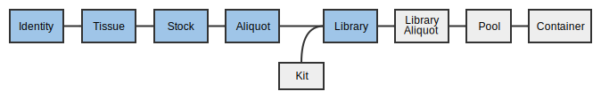

Table of Contents
<ol>
   <li><a href="#1">Logging In</a></li>
   <li><a href="#2">Projects</a></li>
   <li><a href="#3">Incoming Samples</a></li>
   <li><a href="#4">Propagating Samples</a></li>
   <li><a href="#5">Using Boxes</a></li>
   <li><a href="#6">Libraries</a></li>
   <li><a href="#7">Dilutions, Pools, and Orders</a></li>
   <li><a href="#8">Runs and Sequencing Containers</a></li>
   <li><a href="#9">Sequencers</a></li>
</ol>

<a name="1"/>

# 1. Logging In

Much like the old Geospiza LIMS, you need to log in to MISO LIMS in order to
make changes to any LIMS entities. Logging in lets us record any changes you
make and also allows us to set appropriate permissions.

If you were able to log in to Geospiza LIMS, you already have the correct
permissions and can proceed to logging in. If you are a new user, you will need
to contact <ithelpdesk@oicr.on.ca> so that they put you into the appropriate
Active Directory group, `MISO_ROLE_INTERNAL`.

1. Click on <a href="http://miso.gsi.oicr.on.ca"
target="\_new" >http://miso.gsi.oicr.on.ca</a>.
1. Enter your
username (e.g. jdoe) and password and click the Login button.
MISO uses the same username and password as your OICR email account.

If all goes well, you should see the MISO Dashboard and see a message at the
top right: "Logged in as: **jdoe**".

<a name="22"/><a href="#">top</a>

# 2. Projects

A _Project_ contains information about a set of _Studies_ that may comprise many
different _Samples_, _Experiments_ and _Runs_. Samples are attached to Projects as
they are often processed into _Dilutions_, which are then _Pooled_ and sequenced.
Projects also have Overviews, which hold information about a Project proposal.
In this part of this workshop, we will create projects, set permissions, and
familiarize ourselves with the project overview page.

Projects represent a sequencing effort toward a particular goal, usually led by
a particular group or principal investigator. For example, the PCSI project is
sequencing pancreatic tumors, references, cell lines and xenografts as part of
the International Cancer Genome Consortium, and the FFPER project sequences
samples from a bio-bank with a number of different preparations and treatments
in order to determine the impact of each on data quality.

In this workshop, you will make your own project where you will create samples,
libraries and other entities.

Most pages have a "Quick Help" tab at the top right under the Save
button where you can find basic information about the current page.

## 2.1 Creating a new project

1. After logging in, click the _Projects_ link under _Preparation_ in the menu on the left side of
the screen.
1. Select the _Add Project_ button at the top right corner. 

The _Create Project_ page will display with a number of fields that you can fill out.

1. Ignore Project ID and Name, since they are set by MISO once the Project is saved.
1. Enter a unique _Alias_. The alias is a name, chosen by us, that is associated
with a project. The aliases must be a unique and contain only letters or
numbers. It cannot contain spaces or punctuation. e.g. `DoIt4Science` (be creative!)
1. Enter a _Short Name_ for your project. The short name should be 2-5 letters in
all CAPS and related to the project alias. This short name will be used to
automatically generate sample and library names. e.g. short name: `DI4S`
1. In the _Description_ field, enter `MISO training workshop [Date]`
1. Choose the amount of _Progress_ that your project has accomplished:
  * Unknown : I was told to enter this data and I does what they tells me.
  * Active : We are receiving/have received samples and are actively working on
    this project.
  * Inactive : Project is not yet done, but waiting for external collaborators,
    REB approval, papers to be published, etc.
  * Cancelled : Project was scrapped because we did not get funding/samples/REB
    approval.
  * Proposed : Project Initiation form has been received and is awaiting go-ahead
    by Genomics leadership.
  * Pending : We are waiting for the project to start.
  * Approved : Project has been approved by Genomics leadership.

1. Select the _Reference Genome_ `Human hg19 random`. This should be the primary
species that will be sequenced in the course of the project. Xenografts count
as human.
1. In the _Permissions_ section, select `your name` from the _Owner_ drop-down.
1. Make sure that _Allow all internal users access?_ is selected.

<table border="1"><tr><td>
  
</td></tr></table>

1. Click the _Save_ button at the upper right. 

Upon save, you will be taken to the _Edit Project_ page, where you can see the
project you just created. Notice that the Project ID and Name now have values.
The Project ID will be an integer, and the Name will begin with PRO. These are
specific to this project and used by MISO to track the project internally.

### 2.1.1 Add a Study

In order to make sure MISO is SRA-compliant, you must add a _Study_ to your Project. Studies are legacy objects that are not really used in the current system, but need to be added anyway.

1. Click on the _Studies_ section to expand the section.
1. Hover over the _Options_ menu at the top right of the Studies table, and
   click _Add new Study_.
1. Much like creating a Project, enter:
  1. Alias (letters and numbers only): this can have any name, but make sure
it is recognizable as belonging to your Project.
  1. Description: any free-text description
  1. Select a Study Type from the drop-down menu : Unless you are certain of the
sequencing type, select `Other`.
1. Click the _Save_ button at the upper right.

## 2.2 Projects List

1. Click again on the _Projects_ link under _Preparation_ in the menu on the left side of the
screen. You will see a list of all of the projects you have access to in MISO.
1. Find the project you just created in the list. You can sort any column in the
table by clicking the column header. You can also search for your project by
any of the displayed columns and the table will filter as you type. 
1. Click on the link in the Project Name, Short Name or Alias (they all go to the
same page).

## 2.3 Edit Project page

The _Edit Project_ page is used for viewing basic information about a project as
well as all of the entities associated with that project, such as the samples,
libraries, pools, and runs.

Once you create different entities for your project like _Samples, Libraries,
Library Dilutions, Pools_ and _Runs_, you can view and search them on this page.
Each section can be expanded by clicking on its name or the arrow next to it.
The tables under each section can be sorted by the column header or searched
using the field in the upper right. The _Options_ menu above the search bar
contains actions you can perform on the entities in the project.

### 2.3.1 Add a project overview

_Project Overviews_ specify the origin of a specific set of samples
that are part of the project. For example, if you are receiving some samples
from a clinician and other samples from a hospital, you can enter the expected
numbers of samples from each and indicate how many of them passed quality
control and what stage of preparation has been completed. Project overviews are
optional and only used to indicate overall progress on the _My Projects_ page.

1. Click _Add Overview_ at the right side under the Project Information. 
1. In the pop-up, enter a principal investigator (`You Yourname`!)
1. In _No. proposed samples_, enter `5`. 
1. Click the _Add Overview_ button.

The _Edit Project_ page will reload and now there will be a table with your name
under the _Project Information_ section. You can fill in other values if you wish, or
leave them blank for now. You can also select the checkboxes below the table to
show that certain stages have been completed. Remember to press the _Save_
button after you are finished editing.

### 2.3.2 Add Project Files

In the _Project Files_ section, you can add attach any necessary documents to the
project (e.g. Project Information form, REB).

1. Click the _Project Files_ section on the Edit Project page.
1. Find a document or image that is appropriate for your study 

Now that your project has been created, continue to make your first samples.

<a name="3"/><a href="#">top</a>

# 3. Incoming samples

A _Sample_ contains information about the material upon which the sequencing
experiments are to be based. Samples can be used in any number of sequencing
_Experiments_ in the form of a _Library_ that is often processed further into
pooled _Dilutions._

Every received Sample must have an _Identity_. The Identity corresponds to the
individual or organism with whom the sample originated, i.e. the donor. MISO
requires you to assign an external name, which is usually an identifier from
another institution like a Donor ID.

When material is received for sequencing, it can be in many different forms,
called _Sample Classes_ in MISO. Here are the classes of Sample that can be
received:

* Cell line
* Tumour tissue (Primary or Metastatic)
* Reference tissue
* Xenograft tissue
* gDNA (untreated or whole genome amplified)
* cDNA
* whole RNA

Depending on which Sample Class is chosen, more or less fields appear on the
_Create Sample_ page.

In this workshop, we will create six Samples with four different Identities in
the Project you created in the last session.

## 3.1 Entering a single Sample

There are two ways of entering Samples into MISO: Single and Bulk. We will start
by entering a single Sample for reference tissue from the Identity `ID1`.

1. On the left hand menu under _Tracking_, click _Samples_.
1. Click the _Add Sample_ button on the right hand side. There are two tabs
across the top. Ensure that _Single_ is selected.
1. In the _Sample Information_ section, enter or select the following:
  1. Project: Select the project you created in the last exercise.
  1. Alias: leave blank. This will be auto-generated based on other
information in this form.
  1. Description: `Reference 1`.
  1. Date of Receipt: Select a date
  1. Scientific Name: `Homo sapiens`.
  1. Sample Type: select `GENOMIC` from the drop down.
  1. QC Status: select `Ready` from the drop down.
1. In the _Identity_ section:
  1. External names : 
    1. Click _Find or Create Identity_.
    1. In the pop-up window, enter external name: project short name `_ID1` 
(_e.g._, `PROJ_ID2`). This is the name given to the donor by the external 
institute that the tissue came from.
    1. Click _Validate External Name(s)_.
    1. From the dropdown, select `First Receipt`.
    1. Click _Select_.
  1. Sex: Select any item from the dropdown.
1. In the _Details_ section, select the _Sample Class_ `Reference Tissue`.
1. In the _Tissue_ section, select or enter the following to create a reference Sample.
  1. Tissue Origin: `Ly (Lymphocyte)`
  1. Tissue Type: `R (Reference or non-tumour, non-diseased tissue sample)`
  1. Tissue Material: Select any from the drop-down.
  1. External Institute Identifier: `BioBankID 1`. This is the Biobank ID or Tube ID.
It may also be left blank.
  1. Lab: Select `BioBank (University Health Network)` from the drop-down.
  1. Times Received: `1`
  1. Tube Number: `1`
1. At the upper right hand side, click _Save_.

Upon saving, a number of fields will be filled in, including the Alias. The
Tissue
Alias will be in the form PROJ\_0001\_Ly\_R\_nn\_1-1: (Project Short
Name)\_(Individual ID)\_(Tissue Origin)\_(Tissue Type)\_(Passage number)\_(Times
Received)\_(Tube Number). Passage number is only required for Xenografts and Cell
lines. For more information about Sample nomenclature, see <a
href="https://wiki.oicr.on.ca/display/MCPHERSON/LIMS+Guidelines#LIMSGuidelines-SampleNomenclature"
target="_new">Sample Nomenclature</a>.

### 3.1.1 Enter a matrix tube barcode

After saving the Sample, you will be able to enter the barcode for the tube.

1. On the _Edit Sample_ page for the sample you just created, click the arrow next to
the blue _ID_ box at the top right hand corner.
1. Select _Assign New Barcode_ from the menu.
1. Use the hand-scanner or type a barcode into the pop-up. For this exercise,
enter your Project Short Name and _R1. e.g. `PROJ_R1`. We will use this barcode
later in the Box section.
1. Click _Save_ on the pop-up.

The page will re-load with the 2D barcode at the top right.

## 3.2 Automatically created Samples

1. Click the _My Projects_ tab at the top and select your project from the list.
1. Open the _Samples_ section on the _Edit Project_ page to see your newly
created samples.

(You can also find your samples by searching on the _Samples_ page or by
using the widget on the MISO front page. At the moment, searching on the 
_Samples_ page is quite slow but you are welcome to try using that page to view
your samples. The widget is fast but does not show enough information for the
following exercises.)

You only created a single Sample but at least two are in this list: the
Reference tissue as well as the Identity. The Identity sample was automatically
created because you provided an _External name_ that had not been previously
used in this Project, and has a name in the format (Project short
name)\_(Individual number), e.g. PROJ_0001. Other types of Samples are created automatically depending
on how you propagate them through to libraries. Some of them will be addressed
in the following tutorials.

## 3.3 Bulk create Samples

Next, we will create four more Samples using the much faster bulk method. The
four samples will be the Primary Tumour Tissue for individuals 1-5.

1. On the left hand menu under _Tracking_, click _Samples_.
1. Click the _Add Sample_ button on the right hand side. There are two tabs
across the top. Ensure that _Bulk_ is selected.
1. _Select project_ dropdown: select your project.
1. _Select class_ dropdown: `Primary Tumor Tissue`.
1. _Number of samples_ text box: `4`.
1. Click _Make Table_.

A table will appear with the requested number of samples in table format. We
will fill in the first row and use the quick-fill option to fill in the rest of
the table.

Enter the following values into the **first row only**.

1. Sample Alias: leave blank. Again, this will be automatically generated from
the rest of the table.
1. Select or enter the following fields:
  1. Description: `Primary`.
  1. Date of Receipt: select a date
  1. Sample Type: select `GENOMIC` from the drop-down.
  1. Sex: select any item from the drop-down.
  1. Tissue Origin: select `Br (Breast)` from the drop-down.
  1. Tissue Type: select `P (Primary Tumour)` from the drop-down.
  1. Times Received: 1
  1. Tube Number: 1
  1. Lab: select `BioBank (University Health Network)` from the drop-down.
  1. Ext. Inst. Identifier: `BioBankID`
  1. Material: Select any item from the drop down.
  1. QC Status: Select `Ready` from the drop down.

Now we will fill in the rest of the table. Like in Excel, you can fill down a
column by double-clicking the square at the lower right hand side of a selected
cell. You can also click and drag to only fill in a certain number of cells.

1. Click the _Sample Type_ cell in the first row. A blue square will appear at
the lower right hand side. Double click it to fill in the rest of the table with
the word "Primary".
1. Fill in the columns in the same way for: _Sex_, _Tissue
Origin_, _Tissue Type_, _Times Received_, _Tube Number_, and _Material_.

<table border="1"><tr><td>

</td><td>

</td></tr></table>

Some fields cannot be filled down, so enter each of those separately.

1. _Matrix Barcode_: you would normally use a hand-scanner or
copy and paste a list of barcodes from a spreadsheet. In this case, enter the project
short name followed by P and a number. The fill down functionality does not
auto-increment, so these need to be typed. For example:`PROJ_P1`, `PROJ_P2`, `PROJ_P3`, `PROJ_P4`
1. _External Name_:  replace `PROJ` with your own project name.
  - `PROJ_ID1`
  - `PROJ_ID2`
  - `PROJ_ID3`
  - `PROJ_ID4`
  1. Click _Look up Identities_ (above the top left corner of the table).
  1. Select `First Receipt` from the dropdown menu in each cell of the `Identity Alias` column. 
Since these are all first receipt, you may fill them down after selecting it in the top row. If 
the identities already existed, you would have to select them individually.
1. _Ext. Inst. Identifier_: add a number to each row starting from 2, i.e..
`BioBankID 2`, `BioBankID 3`, `BioBankID 4`, `BioBankID 5`.
1. _Description_:

    Copying and pasting from Excel and Word is supported.

    Go to
[http://pastebin.com/uQXhafqJ](http://pastebin.com/uQXhafqJ) and copy the list of descriptions by selecting it
with your mouse, right clicking and selecting _Copy_. Then click on the first
cell in the top row of _Description_ and press Ctrl+V on your keyboard to
paste.
1. Click _Save_ at the upper right hand corner.

If everything is correct, the _Alias_ will be auto-generated for each row and
the samples will be saved. If you navigate back to your _Edit Project_ page,
there should be nine Samples:

* 4 Identity Samples
* 1 Reference Sample
* 4 Primary Samples

Notice also that because you used the same _External Name_, ending in `ID1`,
for two samples, reference and primary, they have the same Identity.

## 3.4 Receiving Stock DNA/RNA

The process for receiving Stock DNA is very similar to receiving
tissue. Every stock derives from a Tissue, which originated from an
Identity. MISO will create the tissue for you when you enter a Stock. These
samples are known as _ghost samples_, which do not exist at OICR but are in MISO
for sample tracking purposes.

In this section, we will 'receive' a single Stock DNA tube from individual 2
reference tumour.

1. On the left hand menu under _Tracking_, click _Samples_.
1. Click the _Add Sample_ button on the right hand side. There are two tabs
across the top. Ensure that _Single_ is selected.
1. In the _Sample Information_ section, enter or select the following:
  1. Project: Select the project you created in the last exercise.
  1. Alias: leave blank. This will be auto-generated based on other
information in this form.
  1. Description: `Stock 1`.
  1. Date of receipt: select a date.
  1. Scientific Name: `Homo sapiens`.
  1. Sample Type: select `GENOMIC` from the drop-down.
  1. QC Status: select `Ready` from the drop-down.
  1. Volume (µl): `300`
1. In the _Identity_ section, enter the
  1. External name : project name `_ID2`.
  1. Sex: Select any item from the dropdown.
1. In the _Details_ section, select the _Sample Class_: `gDNA (stock)`.
1. In the _Tissue_ section, select or enter the following to create a reference
Sample.
  1. Tissue Class: `Reference Tissue`
  1. Tissue Origin: `nn (Unknown)`
  1. Tissue Type: `R (Reference or non-tumour, non-diseased tissue sample)`
  1. Tissue Material: Select any from the drop-down.
  1. External Institute Identifier: `BioBankID 6`.
  1. Lab: `BioBank (University Health Network)`.
  1. Times Received: `1`
  1. Tube Number: `1`
1. At the upper right hand side, click _Save_.

Stock aliases are created from their tissue alias by appending _\_D\_S#_ or _\_R\_S#_.
For example, the first DNA stock that derives from a tissue `PROJ_0002_Ly_R_nn_1-1` has
the name `PROJ_0002_Ly_R_nn_1-1_D_S1`.

After saving, go back to your project page and look at the samples that were
automatically created. Although you received Stock DNA, it has created a Tissue
for you as well.

1. Click on the Tissue  with the alias similar to `PROJ_0002_nn_R_nn_1-1`. It
should have a _Sample Description_ that says only "Tissue".

At the top, you will see a grey section with the warning: "This entity does not
exist except for sample tracking purposes!". This message means that the Tissue
does not exist in a freezer at OICR. Eventually these _ghost samples_ will be
hidden from the MISO interface.

<a name="4"/><a href="#">top</a>

# 4. Propagating Samples

Samples in MISO exist for each step in the tissue preparation: from identity,
to tissue, optionally though tissue preparation, to stock, to aliquot. At each
step, the possible options are limited based on the established workflows.
Group IDs may be assigned at any time and are copied when propagating. Different
QC information is available at each step. For instance, STR status is attached
to the stock.

For the tissue samples created previously (by bulk and single entry), we will create stocks for library preparation.

## 4.1 Bulk Propagate Samples

For three of the tissues you created in the previous section, create a stock.

1. On the _Samples_ page, enter your project name in the search box.
1. Check the boxes for the tissue samples (not the received stock). They will
have names that end in two hyphenated numbers, like `PROJ_0001_Ly_R_nn_1-1`:
  * `PROJ_0001_Br_P_nn_1-1`
  * `PROJ_0001_Ly_R_nn_1-1`
  * `PROJ_0002_Br_P_nn_1-1`
1. From the _Bulk actions_ dropdown at the bottom, select _Propagate (sample) selected_.
1. A new dropdown will appear. Select _gDNA (stock)_ and click _Go_.
1. Fill out the table:
  * _Description_: Free text description. In this case, use "Stock (Tissue
  Type)(Individual)". (e.g. `Stock P2` for `PROJ_0002_Br_P_nn_1-1`)
  * _Matrix Barcode_: (Project short name)\_(Tissue Type)(Individual)\_St,
    - `PROJ_P1_St`
    - `PROJ_R1_St`
    - `PROJ_P2_St`
  * _Vol._: `300`
1. Click _Save_.

Upon successful save, a green status will show at the top that says "Saved 3
items". The Sample Alias will have been filled in with aliases that end in D_S1
(for each first DNA stock of that tissue).

## 4.2 Bulk Editing
Samples can be edited in bulk. Assume that we have done some quality control
and wish to update the QC status of the samples.

In this case we will update several fields of 4 stock samples. We will use the
stocks we entered in the previous step as well as the reference stock entered in
part 3 of this tutorial.

1. On the _Samples_ page, enter your project name in the search box.
1. Check the boxes for the stock samples (propagated and received). These are
the samples that end in D_S1:
  * `PROJ_0001_Br_P_nn_1-1_D_S1`
  * `PROJ_0001_Ly_R_nn_1-1_D_S1`
  * `PROJ_0002_Br_P_nn_1-1_D_S1`
  * `PROJ_0002_Ly_R_nn_1-1_D_S1`
1. From the _Bulk actions_ dropdown at the bottom, select _Update selected_ and click _Go_.
1. Change the _QC Status_ column to `Ready` for all rows.
1. Enter the missing _Matrix Barcode_, e.g. `PROJ_R2_St`
1. Click _Save_.

Upon successful save, a green status will show at the top that says "Saved 4
items.".

## 4.3 Creating Aliquots
Propagate again from the 4 _gDNA (stock)_ samples to _gDNA (aliquot)_.

1. On the _Samples_ page, enter your project name in the search box.
1. Check the boxes for the stock samples. They will have names that end in
`D_S1`:
  * `PROJ_0001_Br_P_nn_1-1_D_S1`
  * `PROJ_0001_Ly_R_nn_1-1_D_S1`
  * `PROJ_0002_Br_P_nn_1-1_D_S1`
  * `PROJ_0002_Ly_R_nn_1-1_D_S1`
1. From the _Bulk actions_ dropdown at the bottom, select _Propagate (sample) selected_.
1. A new dropdown will appear. Select _gDNA (aliquot)_ and click _Go_.
1. Fill out the table:
  * _Sample Alias_: Skip this field. It will be automatically filled in upon
  save.
  * _Description_: Free text description. In this case, use "Aliquot (Tissue
  Type)(Individual)". (e.g. `Aliquot P2` for `PROJ_0002_Br_P_nn_1-1_D_S1`)
  * _Matrix Barcode_: (Project short name)\_(Tissue Type)(Individual)\_Al
    * `PROJ_P1_Al`
    * `PROJ_R1_Al`
    * `PROJ_P2_Al`
    * `PROJ_R2_Al`
  * _Purpose_: Select `Library`
1. Click _Save_.

Upon successful save, a green status will show at the top that says "Saved 4
items". The Sample Alias will have been filled in with aliases that end in D\_1
(for each first aliquot of that stock).

<a name="5"/><a href="#">top</a>

# 5. Using Boxes

Boxes hold samples, libraries, and pools. They do not track reagents or
primers. Boxes are separated into _uses_ for different kinds of storage
(_e.g._, tissue samples versus extracted DNA), but there is no check
that items in a box match. Each box also has a _size_ that includes the
physical dimensions of the box as well as whether the box is compatible
with the VisionMate scanner. Every _position_ in the box is identified
by a standard row letter + column number format (_e.g._, C05).

The goal is to create a box for the samples created in the previous step.

1. From the navigation panel, choose _Boxes_ and then _Add Box_.
1. On the _Create Box_ page, enter the information:
  1. Alias: A short name for the box. Enter your short name followed by
     `_OUTBOX` (e.g. PROJ\_OUTBOX)
  1. _Description_: a human description of the box purpose  “gDNA ready for
    library prep for <project>”.
  1. _Use_: The contents of the box. Select `DNA`.
  1. _Size_: Select `8 x 12 scannable`.
1. Click _Save_.

Upon clicking save, a graphic of the box will appear. You can now load your
samples into the box. All types of samples can be entered in the box, including
the tissues, stocks and aliquots you made in the previous steps.

1. Click on a position in the displayed _Contents_ grid.
1. Enter a matrix barcode into the box on the right and click _Lookup_.
Normally a hand scanner would be used. For this exercise, use this handy
reference list:
  * `PROJ_P1_St`
  * `PROJ_P2_St`
  * `PROJ_R1_St`
  * `PROJ_R2_St`
  * `PROJ_P1_Al`
  * `PROJ_P2_Al`
  * `PROJ_R1_Al`
  * `PROJ_R2_Al`
1. Click _Update Position_. 
  * &#9888; The _Save_ button does not work for individual positions, only for
    _Box Information_.
1. Repeat for all the samples listed above.

The table below the box diagram shows the position and information for the
currently selected sample. If you would like to see all of the samples in the
table, click the _List all Box Contents_ button at the top right of the table.

In the lab, it is possible to use _Options_ > _Scan Box_ to use the plate
scanner and update all positions at once, but that will not be covered in this
tutorial.

## Using Boxes

Boxes can be found either from the Sample or Library page or the _Boxes_ page.

1. On the _Sample_ page, enter your project name.
1. Click on the alias for individual 2 primary stock, i.e.
`PROJ_0002_Br_P_nn_1-1_D_S1`.
1. The Box and position is listed under _Location_ near the top of the _Sample
Information_ section. Click on the link to go to the Box (e.g. `PROJ_OUTBOX,
A03`).

Boxes can be used to store Samples, Libraries and Pools and one box can store all
three types.

### Removing and trashing tubes

When you have a position selected, you can also either remove the tube from the
box (setting its location to "Unknown") or trash the tube, meaning it has been
used up. Trashing the tube sets the volume of the sample to 0 and marks it as
"emptied".

1. From the list below the box, find the location of the
`PROJ_0002_Br_P_nn_1-1_D_S1` sample.
1. Open the sample page in a new tab by clicking on the Sample link (Right click
on the link and select "Open in new tab").
1. Go back to the Box page if necessary. Select the sample you just opened in
the Box and click _Trash Tube_. Click "OK" in the pop-up.
1. Go to the other tab with the _Edit Sample_ page and click the browser refresh
button. The _Location_ field will show as blank, _Volume_ will be set to 0.0,
and the _Emptied_ box will be ticked.

### Moving samples around in boxes

An item can only exist in one box. If assigned to a new box, it will
disappear from the original.

1. In the current tab, go to the _Boxes_ page, find the _TUTORIAL_ box. This box was previously
created by the MISO developers for the tutorial..
1. Choose an empty position and enter your barcode ending in `PROJ_P1_Al` (e.g., `PROJ_P1_Al`).
1. Click _Lookup_ and _Update Position_.
1. Go back to the first tab with your `PROJ_OUTBOX` Box and refresh the
browser, or return to the _Boxes_ page and find your project outbox. The
sample was removed from the outbox.

<a name="6"/><a href="#">top</a>

# 6. Libraries

A _library_ is made from one sample for a single target _platform_ and
has a specific _design_ associated with it that decides the _selection_
and _strategies_ used to make the library. A library may also have _indices_
(primers) and QC information.

MISO stores two important pieces of information about how a library was generated:
the _selection_ (e.g., PCR, cDNA) and the _strategy_ (e.g., WGS, WXS,
amplicon). A _design_ captures both a selection and strategy and the list
of allowed designs is limited based on the sample type (_e.g._, a cDNA sample
can only have SM, WT, or MR library designs and these lock the selection and
strategy type accordingly).

## 6.1 Bulk propagate aliquots into libraries

In this section, you will use the aliquots you created already and create
libraries.

1. On the _Samples_ page, enter your project name into the search box.
1. Check the gDNA aliquot samples to turn into libraries. These samples are the
ones that end in `_D_1`:
  - `PROJ_0001_Br_P_nn_1-1_D_1`
  - `PROJ_0001_Ly_R_nn_1-1_D_1`
  - `PROJ_0002_Br_P_nn_1-1_D_1`
  - `PROJ_0002_Ly_R_nn_1-1_D_1`
1. From the _Bulk actions_ drop down, select _Propagate (library) selected_.
1. A table will appear. Enter the library information:
  * _Library Alias_: The sample alias up to the tissue type (R or P), library
  type, insert size, library design (_e.g._, `DI4S_0001_Br_P_PE_318_WG`).
  For more information about Library nomenclature, see
  <a href="https://wiki.oicr.on.ca/display/MCPHERSON/LIMS+Guidelines#LIMSGuidelines-LibraryNomenclature" 
  target="_new">Library Nomenclature</a>.
  &#9888; This alias does not automatically fill in yet, so it must be entered:
      - `PROJ_0001_Br_P_PE_300_EX`
      - `PROJ_0001_Ly_R_PE_300_EX`
      - `PROJ_0002_Br_P_PE_300_EX`
      - `PROJ_0002_Ly_R_PE_300_EX`
  * _Description_: Library (Tissue type)(individual), e.g. `Library P1`
  * _Matrix Barcode_: As before, usually this would be scanned by the hand
    scanner. In this tutorial, enter matrix barcodes in the form (Short
name)_(Tissue type)(Individual)_Li, e.g. `PROJ_P1_Li`.
  * _Platform_: Illumina
  * _Type_: Paired End
  * _Selection_: PCR
  * _Strategy_: AMPLICON
  * _Index Kit_: Nextera Dual Index
  * _Index 1_ and _Index 2_: Select any combination of indices you wish.
    Select different indices for each library. Selecting the same index for two
    different libraries will make you unable to pool those two libraries
    together later.
  * _Volume_: 100
  * _Kit_: KAPA Hyper Prep
1. Choose _Save_.

Note that for dual-index libraries, only the first index needs to be
specified. The second is optional.

## 6.1 Quality control
There are three way to indicate library quality in MISO: 1)
Enter quantitative QC values under the _Library QC_ section; 2) The overall pre-sequencing quality
flag _QC passed_; and 3) The post-sequencing quality control _Low quality
library_.

### 6.2.1 Library QC
After measuring the insert size or concentration, this information can be
entered into each library. There is no bulk entry for this information yet, it must
be entered for each library.

1. From the _Libraries_ page, find the `PROJ_0001_Br_P_PE_300_EX` library using
the search box and click the sample link.
1. On the right side of the _QCs_ heading, select _Options_ → _Add Library QC_.
1. Enter the information in the row:
  1. _QC Date_: Select a date.
  1. _Method_: Choose a QC instrument.
  1. _Results_: Enter the measurement.
  1. _Insert Size_: Enter the measured insert size.
1. Click _Add_.

### 6.2.2 QC passed
_QC Passed_ is a simple pass/fail flag for a library to decide if it is good
enough for sequencing. If not measured, this can be left as "Unknown".

1. From the _Libraries_ page, find the `PROJ_0001_Br_P_PE_300_EX` library using 
the search box and click the sample link.
1. Change _QC passed_ from _Unknown_ to _True_.
1. Click _Save_.

### 6.2.3 Low Quality Sequencing
Libraries can be marked as having low sequencing quality, which will be shown
after the _Run_ exercises.

## 6.3 Boxes
Libraries can also be placed in boxes.

1. From the _Boxes_ page, find the project-specific box you created before,
e.g. `PROJ_OUTBOX`.
1. Select an unused position and enter a library matrix barcode _PROJ_\_P1\_Li,
e.g. `PROJ_P1_Li`.
1. Click _Lookup_ and then _Update position_.
1. Repeat for the remaining libraries:
  - `PROJ_R1_Li`
  - `PROJ_P2_Li`
  - `PROJ_R2_Li`

<a name="7"/><a href="#">top</a>

# 7. Dilutions, Pools, and Orders

A library cannot be directly loaded into a _lane_ in a _sequencing container_
(flowcell/SMRTcell) in MISO. A dilution must be made and then many dilutions
(or just one) can be mixed into a _pool_ for sequencing.

_Orders_ are requests for sequencing pools a certain number of times. They are
used to keep track of sequencing progress for project management and book-keeping. 

## 7.1 Bulk creating Library Dilutions
Dilutions can be made in bulk from libraries.

In this exercise, we will create 4 library dilutions from the libraries we
made previously.

1. On the _Libraries_ page, check all the libraries just created.
  - `PROJ_0001_Br_P_PE_300_EX`
  - `PROJ_0001_Ly_R_PE_300_EX`
  - `PROJ_0002_Br_P_PE_300_EX`
  - `PROJ_0002_Ly_R_PE_300_EX`
1. From the _Bulk actions_ drop down, select _Make dilutions from selected_ and click _Go_.
1. Enter the concentrations of the dilutions (use any number you wish).
1. Click _Save_.

Dilutions are a bit ephemeral in MISO: there is no list for all the dilutions.
To see the dilutions for a library, view the library page. At present,
Dilutions cannot be saved in Boxes.

## 7.2 Pools
Pools are the last step for libraries before sequencing and represent the
entity that is loaded onto the flowcell lane or SMRTcell. A "pool" can have one or more
library dilutions in it. They are equivalent to "worksets" in Geospiza, but are
required for every lane of sequencing.

Here we will all all of the dilutions we added previously to make a single pool
of 4.

1. On the _Pools_ page, under the _Illumina_ tab, select _Options_ → _Add Pool_.
1. Enter the _Pool Information_:
  1. _Alias_: A short description of the pool contents. Enter the project name
followed by `_POOL` (e.g. `PROJ_POOL`)
  1. _Description_: A longer free-text description of the pool. 
  1. _Platform Type_: Leave `Illumina` selected.
  1. _Desired Concentration_: Enter a concentration.
  1. _Creation Date_: Select a date.
  1. _Ready to Run_: Whether or not the pool is ready for sequencing. This flag
     is used together with the Order to show the pool is ready to be sequenced.
     Tick this box.
  1. _Volume_: Enter a pool volume.
1. In the _Pooled Elements_ section, use the search box to find the dilutions created previously.
1. For each dilution, press the _+_ button to add the dilution to the pool.
1. Click _Save_.

## 7.3 Creating an Order
Orders are created on the pool to be sequenced, and include the quantity of sequencing
required (counted in lanes/SMRT cells), and the sequencing chemistry
required (on Illumina).

1. On the Edit Pool page for the pool you just created, scroll down to the
_Orders_ heading.
1. Fill in the new order box:
  - _Partitions_: the number of lanes/cells that should run for this pool. Enter
`2`
  - _Platform_: Select the instrument for sequencing. `Illumina - Illumina HiSeq 2500`
  - _Sequencing Parameters_: Select `v4 2×126` chemistry.
1. Click _Add_. The order will now be visible in the _Orders_ section.

### 7.3.1  Checking for unfulfilled orders
The _Orders_ page is used to decide what needs to be sequenced.

1. From the navigation menu, choose _Orders_.
1. Verify that the pool you just created is listed in the _Unfulfilled_ tab.

Columns on this page will disappear if there are no entries (_e.g._,
the _Failed_ column will not be shown if there are no failed runs). When enough
lanes have been sequenced, the row will disappear from the _Unfulfilled_ tab,
but remain in the _All_ tab. Lanes currently being sequenced will be marked as
in-progress and remain on the _Unfulfilled_ tab until the run transitions to
_Completed_.

A pool can have many orders. Orders for the same platform and chemistry are
summed when displayed on this page.

<a name="8"/><a href="#">top</a>

# 8. Runs and Sequencing Containers

MISO supports runs from both Illumina and PacBio sequencers (and others that
are no longer used at OICR), so the terms used for instrument runs and
associated libraries are intentionally different from those used by the vendor.
Every time a sequencer is loaded and sequencing begins,
a _Run_ is created. Runs are picked up automatically from the instrument.
A _Sequencing Container_ is the link between the library information and the
instrument Run and contains one or more lanes. Each _lane_ (e.g. Illumina lane,
PacBio SMRT cell) in the container is loaded with exactly one _Pool_.
Runs and Containers can be associated as soon as the sequencer has started.

## 8.1 Viewing Run statistics
About five minutes after an instrument begins sequencing, MISO will detect it
and create a _Run_. As sequencing continues, MISO will pull back information
about the quality of the run similar to the on-instrument applications like SAV.
This includes statistics like percent pass filter, the percent of bases with
Qscores over 30, and cluster density.

1. From the _Runs_ page, find the run assigned to you for this tutorial.

Under the _InterOp Metrics_ section, you will see a loading animation. After a
few seconds to load, this page will show information from the sequencer about
the run progress.
However, this function does not work reliably under load (as when ~20 people
look at runs at the same time during this tutorial), so it may not load. This
functionality will be redesigned in the near future.

## 8.2 Adding a sequencing container to a run

The Run (representing an instrument run) is associated with Pools using a
_Sequencing Container_.

1. On the Run assigned to you, scroll down to the _Containers_ section.
1. Search for the pool you previously created and double click to assign it to
   the lane. If you did not tick the _Ready to Run_ box when creating the Pool, you
   may need to untick this option next to the search field.
1. Click the _Select Study_ button on the Lane to accept the default Study.
1. If the flowcell is being stored, enter the location.
1. Click _Save_.

The validation field is used only by cBot; leave it blank.

Now check on the Order.

1. Click on the _Orders_ page and verify that the _Remaining_ column now
shows 1 for the pool.

### 8.3 Low Quality Sequencing
Not every library realises its full potential. After sequencing, specific
libraries can be flagged as having low sequencing quality. The
"Low Quality Sequencing" indicator causes any pool containing this library to be
flagged, so that it can be checked before it is sequenced again.

1. From the _Libraries_ page, find the `PROJ_0002_Ly_R_PE_300_EX` library
and click the link.
1. Check _Low Quality Sequencing_.
1. Click _Save_.

Now if the Pool containing that Library is added to a Sequencing Container, it
will be flagged red.

1. Go back to your Run page.
1. Find your pool using the search box. It will be flagged red.

<a name="9"/><a href="#">top</a>

# 9. Sequencers

Each sequencer has a service record.

1. Select _Sequencers_.
1. Choose an individual sequencer.
1. Use the blue arrow to expand the _Service Records_ section.
1. From _Options_, choose _Add Sequencer Record_.
1. Fill in the form as follows:
  * _Title_: a short description of the work (_e.g._, `Remove gremlin from sequencer`)
  * _Description_: a long description of the work (_e.g._, `A gremlin was found outside of the terrible 80s movie. It had developed a taste for polymerase.`)
  * _Serviced By_: your name
  * _Service Date_: the current date
1. Click _Save_.

After saving, it is also possible to attach files to the record. Look under the _Attachments_ heading.

<a href="#">top</a>
