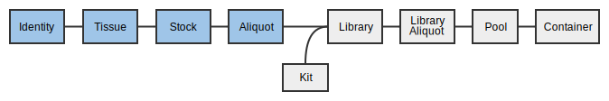

Table of Contents
<ol>
    <li><a href="#login">Logging In</a></li>
    <li><a href="#receipt">Receiving Samples</a></li>
    <li><a href="#props">Propagating Samples</a></li>
    <li><a href="#qcs">Adding Sample QCs</a></li>
    <li><a href="#boxes">Scanning samples into the outbox</a></li>
    <li><a href="#trouble">Troubleshooting</a></li>
</ol>

Download the worksheet for this section here: <a href="2-0-samples-worksheet">Samples Worksheet</a>.

<a name="login"/>

# 1. Logging in


<a name="receipt" href="#" id="toplink">top</a>

# 2. Receiving samples

A _Sample_ contains information about the material upon which the sequencing
experiments are to be based. Samples can be used in any number of sequencing
_Experiments_ in the form of a _Library_ that is often processed further into
pooled _Dilutions._

Every received Sample must have an _Identity_. The Identity corresponds to the
individual or organism with whom the sample originated, i.e. the donor. MISO
requires you to assign an external name, which is usually an identifier from
another institution like a Donor ID.

When material is received for sequencing, it can be in many different forms,
called _Sample Classes_ in MISO. Here are the classes of Sample that can be
received:

* Cell line
* Tumour tissue (Primary or Metastatic)
* Reference tissue
* Xenograft tissue
* gDNA (untreated or whole genome amplified)
* cDNA
* whole RNA

Depending on which Sample Class is chosen, more or less fields appear on the
_Create Sample_ page.

In this workshop, we will create six Samples with four different Identities in
the Project you created in the last session.

## 2.1 Entering a single Tissue

There are two ways of entering Samples into MISO: Single and Bulk. We will start
by entering a single Sample for reference tissue from the Identity `ID1`.

1. On the left hand menu under _Tracking_, click _Samples_.
1. Click the _Add Sample_ button on the right hand side. There are two tabs
   across the top. Ensure that _Single_ is selected.
1. In the _Sample Information_ section, enter or select the following:
    1. Project: Select the project you created in the last exercise.
    1. Alias: leave blank. This will be auto-generated based on other
information in this form.
    1. Description: `Reference 1`.
    1. Date of Receipt: Select a date
    1. Scientific Name: `Homo sapiens`.
    1. Sample Type: select `GENOMIC` from the drop down.
    1. QC Status: select `Ready` from the drop down.
1. In the _Identity_ section:
    1. External names : this is the name of the *individual*, whether internal or external. 
     For example, an external identifier would be "Morgan" (internally we refer to her as plain ol' MORG_0001).
        1. Click _Find or Create Identity_.
        1. In the pop-up window, enter external name: project short name `_ID1` 
(_e.g._, `PROJ_ID2`). This is the name given to the donor by the external 
institute that the tissue came from. Record this in your worksheet. 
        1. Click _Validate External Name(s)_.
        1. From the dropdown, select `First Receipt`.
        1. Click _Select_.
    1. Sex: Select any item from the dropdown.
1. In the _Details_ section, select the _Sample Class_ `Reference Tissue`. 
   Record the class in your worksheet. 
1. In the _Tissue_ section, select or enter the following to create a reference Sample.
    1. Tissue Origin: `Ly (Lymphocyte)`
    1. Tissue Type: `R (Reference or non-tumour, non-diseased tissue sample)`
    1. Tissue Material: Select any from the drop-down.
    1. External Institute Identifier: `BioBankID 1`. This is the Biobank ID or Tube ID.
It may also be left blank.
    1. Lab: Select `BioBank (University Health Network)` from the drop-down.
    1. Times Received: `1`
    1. Tube Number: `1`
1. At the upper right hand side, click _Save_.

Upon saving, a number of fields will be filled in, including the Alias. The Tissue
Alias will be in the form PROJ\_0001\_Ly\_R\_nn\_1-1: (Project Short
Name)\_(Individual ID)\_(Tissue Origin)\_(Tissue Type)\_(Passage number)\_(Times
Received)\_(Tube Number). Passage number is only required for Xenografts and Cell
lines. For more information about Sample nomenclature, see <a
href="https://wiki.oicr.on.ca/display/GENOMICS/LIMS+Guidelines#LIMSGuidelines-SampleNomenclature"
target="_new">Sample Nomenclature</a> on the GENOMICS wiki.

Record the alias in your worksheet.  

### 2.1.1 Enter a matrix tube barcode

After saving the Sample, you will be able to enter the barcode for the tube.

1. On the _Edit Sample_ page for the sample you just created, click the arrow inside
the blue _Barcode_ box at the top right hand corner.
1. Select _Update Barcode_ from the menu.
1. Use the hand-scanner or type a barcode into the pop-up.
   Record the barcode in your worksheet. 
1. Click _Save_ on the pop-up.

The page will re-load with the 2D barcode at the top right.

## 2.2 Automatically created Samples

1. Click the _My Projects_ tab at the top and select your project from the list.
1. Open the _Samples_ section on the _Edit Project_ page to see your newly
created samples.

You can also find your samples by searching on the _Samples_ page or by using the widget
on the MISO front page; however, the widget does not show enough information for the
following exercises.

You only created a single Sample but at least two are in this list: the
Reference tissue as well as the Identity. The Identity sample was automatically
created because you provided an _External name_ that had not been previously
used in this Project, and has a name in the format (Project short
name)\_(Individual number), e.g. PROJ_0001. Other types of Samples are created automatically depending
on how you propagate them through to libraries. Some of them will be addressed
in the following tutorials.

## 2.3 Entering bulk Tissues

Next, we will create four more Samples using the much faster bulk method. The
four samples will be the Primary Tumour Tissue for individuals 1-5.

1. On the left hand menu under _Tracking_, click _Samples_.
1. Click the _Add Sample_ button on the right hand side. There are two tabs
across the top. Ensure that _Bulk_ is selected.
1. _Select project_ dropdown: select your project.
1. _Select class_ dropdown: `Primary Tumor Tissue`.
1. _Number of samples_ text box: `4`.
1. Click _Make Table_.

A table will appear with the requested number of samples in table format. We
will fill in the first row and use the quick-fill option to fill in the rest of
the table.

Enter the following values into the **first row only**.

1. Sample Alias: leave blank. Again, this will be automatically generated from
the rest of the table.
1. Select or enter the following data in the first row:
    1. Date of Receipt: select a date
    1. Sample Type: select `GENOMIC` from the drop-down.
    1. Sex: select any item from the drop-down.
    1. Tissue Origin: select `Br (Breast)` from the drop-down.
    1. Tissue Type: select `P (Primary Tumour)` from the drop-down.
    1. Times Received: 1
    1. Tube Number: 1
    1. Lab: select `BioBank (University Health Network)` from the drop-down.
    1. Ext. Inst. Identifier: `BioBankID`
    1. Material: Select any item from the drop down.
    1. QC Status: Select `Ready` from the drop down.

Now we will fill in the rest of the table. Like in Excel, you can fill down a
column by double-clicking the square at the lower right hand side of a selected
cell. You can also click and drag to only fill in a certain number of cells.

1. Click the _Date of Receipt_ cell in the first row. A blue square will appear at
the lower right hand side. Double click it to fill in the rest of the column with
the same date.
1. Fill in the columns in the same way for: _Sample Type_, _Sex_, _Tissue Origin_,
_Tissue Type_, _Times Received_, _Tube Number_, and _Material_.

<table border="1"><tr><td>

</td><td>

</td></tr></table>

Some fields cannot be filled down, so enter each of those separately. If you
have a label with an incrementing number (_e.g._, `PROJ_1`,
`PROJ_2`), enter two rows, select them, then double click the blue square.

1. _Matrix Barcode_: you would normally use a hand-scanner or
copy and paste a list of barcodes from a spreadsheet. 
For each sample, select a barcode, scan or type it in, and record it in your worksheet. 
1. _External Name_:  Again, this is the name of the *individual*, whether internal or external.
Here's a suggested list. Replace `PROJ` with your own project name.
    - `PROJ_ID1`
    - `PROJ_ID2`
    - `PROJ_ID3`
    - `PROJ_ID4`
    1. Click _Look up Identities_ (above the top left corner of the table).
    1. Because you've already created an Identity with the external name `PROJ_ID1`, it is found as a match
to the external name you entered for the top row. In the `Identity Alias` dropdown menu for the first row,
select the existing Identity.
    1. Select `First Receipt` from the dropdown menu in each remaining cell of the `Identity Alias` column. 
1. _Ext. Inst. Identifier_: add a number to each row starting from 2, i.e..
`BioBankID 2`, `BioBankID 3`, `BioBankID 4`, `BioBankID 5`.
1. _Description_: Copying and pasting from Excel and Word is supported. 
   Copy something from anywhere and press Ctrl+V on your keyboard to
   paste.
1. Click _Save_ at the upper right hand corner.

If everything is correct, the _Alias_ will be auto-generated for each row and
the samples will be saved. 
Record the external identity, class, alias and barcode in your worksheet. 
If you navigate back to your _Edit Project_ page,
there should be nine Samples:

* 4 Identity Samples
* 1 Reference Tissue Sample
* 4 Primary Tumor Tissue Samples

## 2.4 Receiving Stock DNA/RNA

The process for receiving Stock DNA is very similar to receiving
tissue. Every stock derives from a Tissue, which originated from an
Identity. MISO will create the tissue for you when you enter a Stock. These
samples are known as _ghost samples_, which do not exist at OICR but are in MISO
for sample tracking purposes.

In this section, we will 'receive' a single Stock DNA tube from individual 2
reference tumour.

1. On the left hand menu under _Tracking_, click _Samples_.
1. Click the _Add Sample_ button on the right hand side. There are two tabs
across the top. Ensure that _Single_ is selected.
1. In the _Sample Information_ section, enter or select the following:
    1. Project: Select the project you created in the last exercise.
    1. Alias: leave blank. This will be auto-generated based on other
information in this form.
    1. Description: `Stock 1`.
    1. Date of receipt: select a date.
    1. Scientific Name: `Homo sapiens`.
    1. Sample Type: select `GENOMIC` from the drop-down.
    1. QC Status: select `Ready` from the drop-down.
    1. Volume (µl): `300`
1. In the _Identity_ section
    1. Click _Find or Create Identity_.
    1. In the pop-up window, enter external name: project short name `_ID2`
    1. Click _Validate External Name(s)_. The existing Identity should be selected
automatically in the dropdown menu
    1. Click _Select_.
    1. Sex: Select any item from the dropdown.
1. In the _Details_ section, select the _Sample Class_: `gDNA (stock)`.
1. In the _Tissue_ section, select or enter the following to create a (ghost) reference
Sample.
    1. Tissue Class: `Reference Tissue`
    1. Tissue Origin: `nn (Unknown)`
    1. Tissue Type: `R (Reference or non-tumour, non-diseased tissue sample)`
    1. Tissue Material: Select any from the drop-down.
    1. External Institute Identifier: `BioBankID 6`.
    1. Lab: `BioBank (University Health Network)`.
    1. Times Received: `1`
    1. Tube Number: `1`
1. At the upper right hand side, click _Save_.

When you click 'Save', the aliases will be filled in. 
Record the external identity, class, alias and barcode in your worksheet. 
Stock aliases are created from their tissue alias by appending _\_D\_S#_ or _\_R\_S#_.
For example, the first DNA stock that derives from a tissue `PROJ_0002_Ly_R_nn_1-1` has
the name `PROJ_0002_Ly_R_nn_1-1_D_S1`.

After saving, go back to your project page and look at the samples that were
automatically created. Although you received Stock DNA, it has created a Tissue
for you as well.

1. Click on the Tissue with the alias similar to `PROJ_0002_nn_R_nn_1-1`.

At the top, you will see a grey section with the warning: "This entity does not
exist except for sample tracking purposes!". This message means that the Tissue
does not exist in a freezer at OICR. Eventually these _ghost samples_ will be
hidden from the MISO interface.

# 2.5 Scanning tissues and stocks into a Box

In this section we will add the stocks and tissues you just received into your
inbox for further work. 



<a name="props" href="#" id="toplink">top</a>

# 3. Propagating Samples

Samples in MISO exist for each step in the tissue preparation: from identity,
to tissue, optionally though tissue preparation, to stock, to aliquot. At each
step, the possible options are limited based on the established workflows.
Group IDs may be assigned at any time and are copied when propagating. Different
QC information is available at each step. For instance, STR status is attached
to the stock.

## 3.1 Propagating to Tissue Processing

Tissue processing is an optional step between the Tissue and Stock levels of the
sample hierarchy. It includes steps such as slides and laser capture microdissections
created from the tissue.

Create a CV Slide from one of your Tissue samples.

1. On the _Sample_ page, enter your project name in the search box.
1. Check the box for the lymphocyte reference tissue you created in exercise 2.1.
(_e.g._ `PROJ_0001_Ly_R_nn_1-1`)
1. From the _Bulk actions_ dropdown at the bottom, select _Propagate (sample) selected_.
1. A new dropdown will appear. Select _CV Slide_ and click _Go_.
1. Fill out the table:
  * _Description_: CV Slides
  * _Slides_: 3
  * _Discards_: 0
1. Click _Save_.

Upon successful save, a green status will show at the top that says "Saved 1
items". The Sample Alias will have been filled in with an alias that ends in CV01.
Record the alias in your worksheet. 

## 3.2 Bulk Propagate Samples

For three of the tissue samples created previously (by bulk entry), we will
create stocks for library preparation.

1. On the _Samples_ page, enter your project name in the search box.
1. Check the boxes for any three of the the Primary Tumor Tissue samples (not the Reference Tissues)
that you created in section 2.3. They will have names that end with `_Br_P_nn_1-1`.
1. From the _Bulk actions_ dropdown at the bottom, select _Propagate (sample) selected_.
1. A new dropdown will appear. Select _gDNA (stock)_ and click _Go_.
1. Fill out the table:
  * _Description_: Free text description. In this case, use "Stock (Tissue
  Type)(Individual)". (e.g. `Stock P2` for `PROJ_0002_Br_P_nn_1-1`)
  * _Matrix Barcode_: choose a barcode for each stock and record it on your worksheet.
  * _Vol._: `300`
1. Click _Save_.

Upon successful save, a green status will show at the top that says "Saved 3
items". The Sample Alias will have been filled in with aliases that end in D_S1
(for each first DNA stock of that tissue). Record the aliases in your worksheet. 

## 3.3 Bulk Editing
Samples can be edited in bulk. Assume that we have done some quality control
and wish to update the QC status of the samples.

In this case we will update several fields of 4 stock samples. We will use the
stocks we entered in the previous step as well as the reference stock entered in
part 3 of this tutorial.

1. On the _Samples_ page, enter your project name in the search box.
1. Check the boxes for the stock samples (propagated and received) that you created in
sections 2.4 and 3.1. These are the samples with aliases that end with `_D_S1`.
1. From the _Bulk actions_ dropdown at the bottom, select _Update selected_ and click _Go_.
1. Change the _QC Status_ column to `Ready` for all rows.
1. Enter a _Matrix Barcode_ for the stock entered in section 2.4 and record it on your worksheet. 
1. Click _Save_.

Upon successful save, a green status will show at the top that says "Saved 4
items.".

## 3.4 Creating Aliquots
Propagate again from the 4 _gDNA (stock)_ samples to _gDNA (aliquot)_.

1. On the _Samples_ page, enter your project name in the search box.
1. Check the boxes for the stock samples. They will have names that end in
`_D_S1`.
1. From the _Bulk actions_ dropdown at the bottom, select _Propagate (sample) selected_.
1. A new dropdown will appear. Select _gDNA (aliquot)_ and click _Go_.
1. Fill out the table:
  * _Sample Alias_: Skip this field. It will be automatically filled in upon
  save.
  * _Description_: Free text description. In this case, use "Aliquot (Tissue
  Type)(Individual)". (e.g. `Aliquot P2` for `PROJ_0002_Br_P_nn_1-1_D_S1`)
  * _Matrix Barcode_: choose a barcode for each aliquot and record it on your worksheet. 
  * _Purpose_: Select `Library`
1. Click _Save_.

Upon successful save, a green status will show at the top that says "Saved 4
items". The Sample Alias will have been filled in with aliases that end in D\_1
(for each first aliquot of that stock). Record these on your worksheet. 

<a name="qcs" href="#" id="toplink">top</a>

# 4. Sample QCs

Several QC methods are supported in MISO. Currently they must be entered individually per
sample, but there are plans to add bulk QC in the near future.

## 4.1 Adding Sample QCs

Add a QC for one of your existing aliquots.

1. On the _Samples_ page, enter your project name in the search box.
1. Click on one of your gDNA aliquots. Its alias should end with `_D_1`.
1. Near the bottom of the page, beside the QCs heading, click _Options_ and select
_Add Sample QC_.
1. For _QC Date_, select today's date
1. _Method_: QuBit
1. _Results_: 50
1. Click _Add_. The QC will be added to the table

<a name="boxes" href="#" id="toplink">top</a>

# 5. Scanning aliquots into outboxes

Finally, scan the aliquots you made into the outbox so the libraries team can
take over.



<a name="trouble" href="#" id="toplink">top</a>

# Troubleshooting

**How do you work with multiple samples derived from the same identity (i.e. DNA and RNA from one tissue slide, DNA from metastasis and control)**

On the _Samples_ page, you can enter the identity's alias into the search box to filter the list.
If the samples you are looking for have more of their alias in common, you can enter as much as
they share to further narrow the search. e.g. to find all stock samples made from tissue
`PROJ_0001_Ly_R_nn_1-1`, you could search for "PROJ_0001_Ly_R_nn_1-1_D_S".

Once you have found all of the samples you wish to work with, select them by clicking the
checkboxes on the left, and choose a bulk action from the menu at the bottom.

**How do I correct a sample that has the wrong information, e.g. wrong tissue type?**

Most sample attributes may be modified either individually, or in bulk. To access the
_Edit Sample_ page for a single sample, click the sample's name or alias on the _Samples_ page.
To bulk edit a set of samples, click the checkboxes next to them on the _Samples_ page, choose
_Update Selected_ from the _Bulk actions_ menu, and click _Go_.

For attributes which cannot be changed via MISO (e.g. Sample Class), please email gsi@oicr.on.ca
or file a JIRA ticket in GSI Common to get assistance from the MISO team.

**What if I need to change the parent of a sample? (e.g. for swaps)**

Please email gsi@oicr.on.ca or file a JIRA ticket in GSI Common to get assistance from the MISO team.

**What do I have to enter if receiving a pre-made library?**

MISO does not yet accept direct receipt of libraries. In cases where libraries are
received, you are required to first create the aliquot and then propagate the library from it.
The aliquot may be created by using the Create Sample page (single or bulk), or by propagating
from an existing tissue or stock Sample. Propagating libraries is detailed in a later tutorial:
[Propagating aliquots to libraries](3-0-libraries#props1)

**How can I add a new tissue type, tissue origin,  or add anything else in drop-down menus?**

Please email gsi@oicr.on.ca or file a JIRA ticket in GSI Common to get assistance from the MISO team.

< <a href="1-0-project-coordination">Project coordination tutorial</a> | <a href="index">Home</a> | <a href="3-0-libraries">Libraries tutorial</a> >
