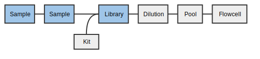
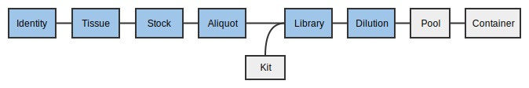
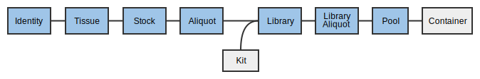

Table of Contents
<ol>
   <li><a href="#login">Logging In</a></li>
   <li><a href="#props1">Propagating aliquots to libraries</a></li>
   <li><a href="#qcs">Adding Library QCs</a></li>
   <li><a href="#props2">Propagating libraries to dilutions</a></li>
   <li><a href="#boxes">Working with Boxes</a></li>
   <li><a href="#pools">Creating Pools</a></li>
   <li><a href="#orders">Ordering sequencing</a></li>
   <li><a href="#trouble">Troubleshooting</a></li>
</ol>

Download the worksheet for this section here: <a href="3-0-libraries-worksheet">Libraries Worksheet</a>.

<a name="login"/>

# 1. Logging in



<a name="props1"/>

# 2. Propagating aliquots to libraries

A _library_ is made from one sample for a single target _platform_ and
has a specific _design_ associated with it that decides the _selection_
and _strategies_ used to make the library. A library may also have _indices_
(primers) and QC information.

MISO stores two important pieces of information about how a library was generated:
the _selection_ (e.g., PCR, cDNA) and the _strategy_ (e.g., WGS, WXS,
amplicon). A _design_ captures both a selection and strategy and the list
of allowed designs is limited based on the sample type (_e.g._, a cDNA sample
can only have SM, WT, or MR library designs and these lock the selection and
strategy type accordingly).

## 2.1 Bulk propagate aliquots into libraries

In this section, you will use the aliquots you created already and create
libraries.

1. On the _Samples_ page, enter your project name into the search box.
1. Check the gDNA aliquot samples to turn into libraries. These samples are the
ones that end in `_D_1`:
  - `PROJ_0001_Br_P_nn_1-1_D_1`
  - `PROJ_0001_Ly_R_nn_1-1_D_1`
  - `PROJ_0002_Br_P_nn_1-1_D_1`
  - `PROJ_0002_Ly_R_nn_1-1_D_1`
1. From the _Bulk actions_ drop down, select _Propagate (library) selected_.
1. A table will appear. Enter the library information:
  * _Library Alias_: The sample alias up to the tissue type (R or P), library
  type, insert size, library design (_e.g._, `DI4S_0001_Br_P_PE_318_WG`).
  For more information about Library nomenclature, see
  <a href="https://wiki.oicr.on.ca/display/MCPHERSON/LIMS+Guidelines#LIMSGuidelines-LibraryNomenclature" 
  target="_new">Library Nomenclature</a>.
  &#9888; This alias does not automatically fill in yet, so it must be entered:
      - `PROJ_0001_Br_P_PE_300_EX`
      - `PROJ_0001_Ly_R_PE_300_EX`
      - `PROJ_0002_Br_P_PE_300_EX`
      - `PROJ_0002_Ly_R_PE_300_EX`
  * _Matrix Barcode_: As before, usually this would be scanned by the hand
    scanner. In this tutorial, enter matrix barcodes in the form (Short
name)_(Tissue type)(Individual)_Li, e.g. `PROJ_P1_Li`.
  * _Description_: Library (Tissue type)(individual), e.g. `Library P1`
  * _Design_: EX
  * _Platform_: Illumina
  * _Type_: Paired End
  * _Index Kit_: Nextera Dual Index
  * _Index 1_ and _Index 2_: Select any combination of indices you wish.
    Select different indices for each library. Selecting the same index for two
    different libraries will make you unable to pool those two libraries
    together later.
  * _Volume_: 100
  * _Kit_: KAPA Hyper Prep
1. Choose _Save_.

Note that for dual-index libraries, only the first index needs to be
specified. The second is optional.

<a name="qcs"/>

# 3. Quality control
There are three way to indicate library quality in MISO: 1)
Enter quantitative QC values under the _Library QC_ section; 2) The overall pre-sequencing quality
flag _QC passed_; and 3) The post-sequencing quality control _Low quality
library_.

## 3.1 Library QC
After measuring the insert size or concentration, this information can be
entered into each library. There is no bulk entry for this information yet, it must
be entered for each library.

1. From the _Libraries_ page, find the `PROJ_0001_Br_P_PE_300_EX` library using
the search box and click the sample link.
1. On the right side of the _QCs_ heading, select _Options_ → _Add Library QC_.
1. Enter the information in the row:
  1. _QC Date_: Select a date.
  1. _Method_: Choose a QC instrument.
  1. _Results_: Enter the measurement.
  1. _Insert Size_: Enter the measured insert size.
1. Click _Add_.

## 3.2 QC passed
_QC Passed_ is a simple pass/fail flag for a library to decide if it is good
enough for sequencing. If not measured, this can be left as "Unknown".

1. From the _Libraries_ page, find the `PROJ_0001_Br_P_PE_300_EX` library using 
the search box and click the sample link.
1. Change _QC passed_ from _Unknown_ to _True_.
1. Click _Save_.

## 3.3 Low Quality Sequencing
Libraries can be marked as having low sequencing quality, which will be shown
after the _Run_ exercises.

<a name="boxes"/>

# 4. Boxes
Libraries can also be placed in boxes.

1. From the _Boxes_ page, find the project-specific box you created before,
e.g. `PROJ_OUTBOX`.
1. Select an unused position and enter a library matrix barcode _PROJ_\_P1\_Li,
e.g. `PROJ_P1_Li`.
1. Click _Lookup_ and then _Update position_.
1. Repeat for the remaining libraries:
  - `PROJ_R1_Li`
  - `PROJ_P2_Li`
  - `PROJ_R2_Li`



<a name="props2"/>

# 5. Propagating libraries to dilutions

A library cannot be directly loaded into a _lane_ in a _sequencing container_
(flowcell/SMRTcell) in MISO. A dilution must be made and then many dilutions
(or just one) can be mixed into a _pool_ for sequencing.

_Orders_ are requests for sequencing pools a certain number of times. They are
used to keep track of sequencing progress for project management and book-keeping. 

## 5.1 Bulk creating Library Dilutions
Dilutions can be made in bulk from libraries.

In this exercise, we will create 4 library dilutions from the libraries we
made previously.

1. On the _Libraries_ page, check all the libraries just created.
  - `PROJ_0001_Br_P_PE_300_EX`
  - `PROJ_0001_Ly_R_PE_300_EX`
  - `PROJ_0002_Br_P_PE_300_EX`
  - `PROJ_0002_Ly_R_PE_300_EX`
1. From the _Bulk actions_ drop down, select _Make dilutions from selected_ and click _Go_.
1. Enter the concentrations of the dilutions (use any number you wish).
1. Click _Save_.

Dilutions are a bit ephemeral in MISO: there is no list for all the dilutions.
To see the dilutions for a library, view the library page. At present,
Dilutions cannot be saved in Boxes.

<a name="pools"/>

# 6. Creating Pools

Pools are the last step for libraries before sequencing and represent the
entity that is loaded onto the flowcell lane or SMRTcell. A "pool" can have one or more
library dilutions in it. They are equivalent to "worksets" in Geospiza, but are
required for every lane of sequencing.

Here we will all all of the dilutions we added previously to make a single pool
of 4.

1. On the _Pools_ page, under the _Illumina_ tab, select _Options_ → _Add Pool_.
1. Enter the _Pool Information_:
  1. _Alias_: A short description of the pool contents. Enter the project name
followed by `_POOL` (e.g. `PROJ_POOL`)
  1. _Description_: A longer free-text description of the pool. 
  1. _Platform Type_: Leave `Illumina` selected.
  1. _Desired Concentration_: Enter a concentration.
  1. _Creation Date_: Select a date.
  1. _Ready to Run_: Whether or not the pool is ready for sequencing. This flag
     is used together with the Order to show the pool is ready to be sequenced.
     Tick this box.
  1. _Volume_: Enter a pool volume.
1. Click _Save_.
1. In the _Pooled Elements_ section, use the search box to find the dilutions created previously.
1. For each dilution, press the _+_ button to add the dilution to the pool.

<a name="orders"/>

# 7. Ordering sequencing

Orders are created on the pool to be sequenced, and include the quantity of sequencing
required (counted in lanes/SMRT cells), and the sequencing chemistry
required (on Illumina).

1. On the Edit Pool page for the pool you just created, scroll down to the
_Orders_ heading.
1. Click _Add Order_:
1. Fill in the new order box:
  - _Partitions_: the number of lanes/cells that should run for this pool. Enter
`2`
  - _Platform_: Select the instrument for sequencing. `Illumina - Illumina HiSeq 2500`
  - _Sequencing Parameters_: Select `v4 2×126` chemistry.
1. Click _Save_. The order will now be visible in the _Orders_ section.

### 7.1  Checking for unfulfilled orders
The _Orders_ page is used to decide what needs to be sequenced.

1. From the navigation menu, choose _Orders_.
1. Verify that the pool you just created is listed in the _Unfulfilled_ tab.

Columns on this page will disappear if there are no entries (_e.g._,
the _Failed_ column will not be shown if there are no failed runs). When enough
lanes have been sequenced, the row will disappear from the _Unfulfilled_ tab,
but remain in the _All_ tab. Lanes currently being sequenced will be marked as
in-progress and remain on the _Unfulfilled_ tab until the run transitions to
_Completed_.

A pool can have many orders. Orders for the same platform and chemistry are
summed when displayed on this page.

<a name="trouble"/>

# Troubleshooting

1. How do I correct an index on a library?
1. What if I assign a library to the wrong parent aliquot?
1. What if I forget to put a library dilution in a pool?
1. How do I change the targeted sequencing type on a library?
1. How can I add a new targeted sequencing type, kit, or anything else in drop-down menus?
1. How do I make bulk orders?
1. How are matrix tube barcodes assigned to tubes?
1. What is the importance of selecting a study (?) since it prevents the Sequencing stage from adding pools to the lane containers?

< <a href="2-0-samples">Samples tutorial</a> | <a href="index">Home</a> | <a href="4-0-sequencing">Sequencing tutorial</a> >

