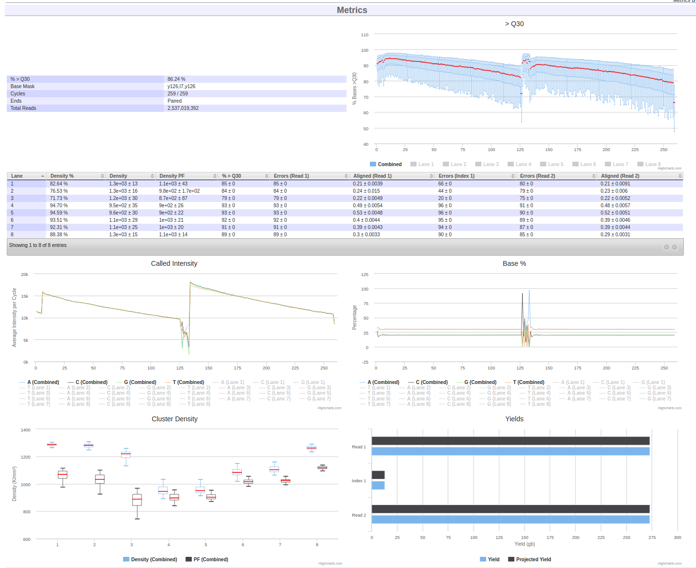

Table of Contents
<ol>
   <li><a href="#login">Logging In</a></li>
   <li><a href="#orders">Checking for sequencing Orders</a></li>
   <li><a href="#nruns">Creating Runs from scratch</a></li>
   <li><a href="#aruns">Working with automatically created runs</a></li>
   <li><a href="#pools">Adding Pools to Runs</a></li>
   <li><a href="#boxes">Scanning libraries into your outbox</a></li>
   <li><a href="#service">Adding Service Records to Sequencers</a></li>
   <li><a href="#trouble">Troubleshooting</a></li>
</ol>

Download the worksheet for this section here: <a href="4-0-sequencing-worksheet">Sequencing Worksheet</a>.

<a name="login"/>

# 1. Logging in



<a name="orders" href="#" id="toplink">top</a>

# 2. Checking for unfulfilled orders



<a name="nruns" href="#" id="toplink">top</a>

## 2.1 Scan libraries into your inbox

First, scan the libraries from the libraries team into your inbox for further
work.



# 3. Creating runs from scratch

MISO supports runs from both Illumina and PacBio sequencers (and others that
are no longer used at OICR), so the terms used for instrument runs and
associated libraries are intentionally different from those used by the vendor.
Every time a sequencer is loaded and sequencing begins,
a _Run_ is created. Runs are picked up automatically from the instrument.
A _Sequencing Container_ is the link between the library information and the
instrument Run and contains one or more lanes. Each Illumina lane, or
PacBio SMRT cell in the container is loaded with exactly one _Pool_.  Runs and
Containers can be associated as soon as the Run and Container are both created. 

## 3.1 Create a Container

1. On the _Sequencing Containers_ page, click the _Create Flowcell_ button near the top left of the table.
1. Select _NextSeq 550_ platform. Only active (non-retired) models are available.
1. Select _4 Lane_ for the size of the container.
1. Enter the short name of your project as the serial number (_e.g._ `PROJ`, `PCSI`, `FFPE`).
1. Click _Save_ in the upper right corner of the page.

## 3.2 Create a Run

1. On the _Runs_ page, select the Illumina platform and click the _Create Illumina Run_ button near the top left corner of the table.
1. Select _NB551056 (NextSeq 550)_ from the sequencers list. Only active (non-retired) sequencers are available.
1. Enter a unique and memorable _Alias_ for your run.
1. In the _Run Path_ field, enter `path` as the file path to the sequencer output.
1. Select _Sequencing Parameters_ `High 2×151`, near the top of the Run section.
1. Check _Paired End_.
1. Select the _Running_ status. Note that if MISO does not automatically detect runs from this sequencer, all status updates will have to be entered manually.
1. Enter a date into _Start Date_.
1. Click _Save_ in the upper right corner of the page.
1. In the _Flow Cell_ section, click the _Add Flow Cell_ button.
1. Enter the flow cell serial number of the container you have just created and click the _Add_ button.

<a name="aruns" href="#" id="toplink">top</a>

# 4. Working with automatically created runs

About five minutes after an instrument begins imaging, MISO will detect it
and create a _Run_. As sequencing continues, MISO will pull back information
about the quality of the run similar to the on-instrument applications like SAV.
This includes statistics like percent pass filter, the percent of bases with
Qscores over 30, and cluster density.

1. From the _Runs_ page, find the run assigned to you for this tutorial. Click
on the run alias to go to the run page.
1. Scroll down to the _Metrics_ section and examine the sequencing metrics for
this run.

<a name="pools" href="#" id="toplink">top</a>

# 5. Adding pools to runs

The Run (representing an instrument run) is associated with Pools using a
_Sequencing Container_.

## 5.1 Add a pool to a run

1. On the Run assigned to you, scroll down to the _Lanes_ section.
1. Check the first the lane.
1. Click _Assign Pool_ from the toolbar.
1. Search for the pool you previously created. Try _Outstanding Orders (Matched Chemistry)_.
1. Click the pool from the list.

Now check on the Order.

1. Click on the _Orders_ page and verify that the _Remaining_ column now
shows 1 for the pool you added to the run.

<a name="lowQuality" href="#" id="toplink">top</a>

## 5.1 Mark a library as Low Quality
Not every library realises its full potential. After sequencing, specific
libraries can be flagged as having low sequencing quality. The
"Low Quality Sequencing" indicator causes any pool containing this library to be
flagged, so that it can be checked before it is sequenced again.

1. From the _Libraries_ page, find the `PROJ_0002_Ly_R_PE_300_EX` library
and click the link.
1. Check _Low Quality Sequencing_.
1. Click _Save_.

Now if the Pool containing that Library is added to a Sequencing Container, it
will be flagged.

1. Go back to your Run page.
1. Find your pool using the lanes table. It will be flagged red.

<a name="boxes" href="#" id="toplink">top</a>

## 5.2 Setting Per-Lane QCs
Sometimes a particular lane is bad. MISO allows setting a per-lane QC. This does _not_ prevent analysis. Contact GSI when a lane should not be analysed.

1. Go to your run page.
1. Check the first run.
1. Click _Set QC_ from the toolbar.
1. Pick _Failed: Other problem_.
1. Enter a description of the problem.
1. Click _Set_.

# 6. Scanning libraries/pools into your outbox

Lastly, place the libraries/pools in your outbox for storage.



<a name="service" href="#" id="toplink">top</a>

# 7. Adding Service Records to Sequencers

Each sequencer can have one or more associated service records.

1. Select _Sequencers_.
1. Choose an individual sequencer.
1. Use the blue arrow to expand the _Service Records_ section.
1. From _Options_, choose _Add Sequencer Record_.
1. Fill in the form as follows:
  * _Title_: a short description of the work (_e.g._, `Remove gremlin from sequencer`)
  * _Description_: a long description of the work (_e.g._, `A gremlin was found outside of the terrible 80s movie. It had developed a taste for polymerase.`)
  * _Serviced By_: your name
  * _Service Date_: the current date
1. Click _Save_.

After saving, it is also possible to attach files to the record. Look under the _Attachments_ heading.

<a name="trouble" href="#" id="toplink">top</a>

# 8. Troubleshooting

1. When instruments break down, how do you log failures into the system?
    * Add a service record as in <a href="#service">7: Adding Service Records to Sequencers</a>
1. How do you assign single lane failures (if possible)?
    * It is possible to add a RunQC which allows you to select one or more lanes, but adding one does not change the Orders count for the pool in that lane (ie. it does not "requeue" the pool). At this time, please go to the Edit Pool page for the pool in the lane and add another Order for the number of lanes and sequencing parameters requested.
1. How you fail flowcells? Or how does MISO detect failed runs?
    * If MISO automatically detects runs from this sequencer, then in most cases MISO will automatically detect failed runs if the run has begun sequencing.
    * If MISO does not automatically detect runs from this sequencer or you note that MISO has not detected that the run has failed, then you must select the `Failed` status on the Edit Run page, and enter a completion date.
    * If the pool contains a single library and you know that the library is of low enough quality that sequencing should not be attempted again, follow the steps to <a href="#lowQuality">mark a library as Low Quality</a>.

< <a href="3-0-libraries">Libraries tutorial</a> | <a href="index">Home</a>
