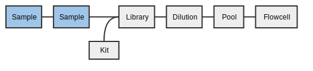

# 4. Propagating Samples
Samples in MISO exist for each step in the tissue preparation: from identity,
to tissue, optionally though tissue preparation, to stock, to aliquot. At each
step, the possible options are limited based on the established workflows.
Group IDs may be assigned at any time and are copied when propagating. Different
QC information is available at each step. For instance, STR status is attached
to the stock.

For the tissue samples created previously (by bulk and single entry), we will create stocks for library preparation.

## 4.1 Bulk Propagate Samples

For three of the tissues you created in the previous section, create a stock.

1. On the _List Samples_ page, enter your project name in the search box.
1. Check the boxes for the tissue samples. They will
have names that end in two hyphenated numbers, like `DI4S_0001_Ly_R_nn_1-1`:
* Individual 1, primary tissue: \_0001\_Br\_P\_nn\_1-1
* Individual 1, reference tissue: \_0001\_Ly\_R\_nn\_1-1
* Individual 2, primary tissue: \_0002\_Br\_P\_nn\_1-1
1. From the _Bulk actions_ dropdown at the bottom, select _Propagate (sample) selected_.
1. A new dropdown will appear. Select _gDNA (stock)_ and click _Go_.
1. Fill out the table:
  * _Description_: Free text description. In this case, use "Stock (Tissue
  Type)(Individual)". (e.g. `Stock P2` for DI4S_0002_Br_P_nn_1-1)
  * _Matrix Barcode_: (Project short name)\_(Tissue Type)(Individual\_St (_e.g._,
  `DI4S_P2_St` for DI4S_0002_Br_P_nn_1-1)
1. Click _Save_.

Upon successful save, a green status will show at the top that says "Saved 3
items". The Sample Alias will have been filled in with aliases that end in D_S1
(for each first DNA stock of that tissue).

## 4.2 Bulk Editing
Samples can be edited in bulk. Assume that we have done some quality control
and wish to update the QC status of the samples.

In this case we will update several fields of 4 stock samples. We will use the
stocks we entered in the previous step as well as the reference stock entered in
part 3 of this tutorial.

1. On the _List Samples_ page, enter your project name in the search box.
1. Check the boxes for the stock samples (propagated and received). These are
the samples that end in D_S1:
* 0001_Br_P_nn_1-1_D_S1
* 0001_Ly_R_nn_1-1_D_S1
* 0002_Br_P_nn_1-1_D_S1
* 0002_Ly_R_nn_1-1_D_S1
1. From the _Bulk actions_ dropdown at the bottom, select _Update selected_ and click _Go_.
1. Change the _QC passed_ column to `true` for all rows.
1. Enter the missing _Matrix Barcode_, e.g. `DI4S_R2_St`
1. Click _Save_.

Upon successful save, a green status will show at the top that says "Saved 4
items.".

## 4.3 Creating Aliquots
Propagate again from the 4 _gDNA (stock)_ samples to _gDNA (aliquot)_.

1. On the _List Samples_ page, enter your project name in the search box.
1. Check the boxes for the stock samples. They will have names that end in D_S1,
like `DI4S_0001_Ly_R_nn_1-1_D_S1`:
* Individual 1, primary tissue: \_0001\_Br\_P\_nn\_1-1_D_S1
* Individual 1, reference tissue: \_0001\_Ly\_R\_nn\_1-1_D_S1
* Individual 2, primary tissue: \_0002\_Br\_P\_nn\_1-1_D_S1
* Individual 2, reference tissue: \_0002\_Ly\_R\_nn\_1-1_D_S1
1. From the _Bulk actions_ dropdown at the bottom, select _Propagate (sample) selected_.
1. A new dropdown will appear. Select _gDNA (aliquot)_ and click _Go_.
1. Fill out the table:
  * _Sample Alias_: Skip this field. It will be automatically filled in upon
  save.
  * _Description_: Free text description. In this case, use "Aliquot (Tissue
  Type)(Individual)". (e.g. `Aliquot P2` for DI4S_0002_Br_P_nn_1-1_D_S1)
  * _Matrix Barcode_: (Project short name)\_(Tissue Type)(Individual\_Al (_e.g._,
  `DI4S_P2_Al` for DI4S_0002_Br_P_nn_1-1_D_S1)
  * _Purpose_: Select `Library`
1. Click _Save_.

Upon successful save, a green status will show at the top that says "Saved 4
items". The Sample Alias will have been filled in with aliases that end in D_1
(for each first aliquot of that stock).

[Back](3-incoming) [Home](index) [Next](5-boxes)
