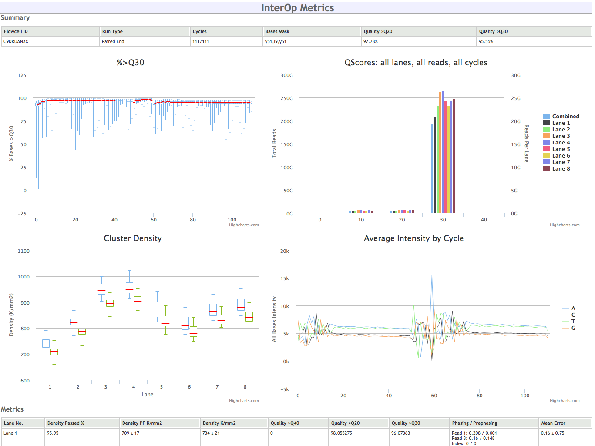

# 8. Runs and Sequencing Containers
MISO supports runs from both Illumina and PacBio sequencers (and others that
are no longer used at OICR), so the terms used for instrument runs and
associated libraries are intentionally different from those used by the vendor.
Every time a sequencer is loaded and sequencing begins,
a _Run_ is created. Runs are picked up automatically from the instrument.
A _Sequencing Container_ is the link between the library information and the
instrument Run and contains one or more lanes. Each _lane_ (e.g. Illumina lane,
PacBio SMRT cell) in the container is loaded with exactly one _Pool_.
Runs and Containers can be associated as soon as the sequencer has started.

## 8.1 Viewing Run statistics
About five minutes after an instrument begins sequencing, MISO will detect it
and create a _Run_. As sequencing continues, MISO will pull back information
about the quality of the run similar to the on-instrument applications like SAV.
This includes statistics like percent pass filter, the percent of bases with
Qscores over 30, and cluster density.

1. From the _List Runs_ page, find the run assigned to you for this tutorial.

Under the _InterOp Metrics_ section, you will see a loading animation. After a
few seconds to load, this page will show information from the sequencer about
the run progress.
However, this function does not work reliably under load (as when ~20 people
look at runs at the same time during this tutorial), so it may not load. This
functionality will be redesigned in the near future.

## 8.2 Adding a sequencing container to a run

The Run (representing an instrument run) is associated with Pools using a
_Sequencing Container_.

1. On the Run assigned to you, scroll down to the _Containers_ section.
1. Search for the pool you previously created and double click to assign it to
   the lane. If you did not tick the _Ready to Run_ box when creating the Pool, you
   may need to untick this option next to the search field.
1. Click the _Select Study_ button on the Lane to accept the default Study.
1. If the flowcell is being stored, enter the location.
1. Click _Save_.

The validation field is used only by cBot; leave it blank.

Now check on the Order.

1. Click on the _List Orders_ page and verify that the _Remaining_ column now
shows 1 for the pool.

### 8.3 Low Quality Sequencing
Not every library realises its full potential. After sequencing, specific
libraries can be flagged as having low sequencing quality. The
"Low Quality Sequencing" indicator causes any pool containing this library to be
flagged, so that it can be checked before it is sequenced again.

1. From the _List Libraries_ page, find the `PROJ_0002_Ly_R_PE_300_EX` library
and click the link.
1. Check _Low Quality Sequencing_.
1. Click _Save_.

Now if the Pool containing that Library is added to a Sequencing Container, it
will be flagged red.

1. Go back to your Run page.
1. Find your pool using the search box. It will be flagged red.

[Back](7-pools) [Home](index) [Next](9-sequencers)
