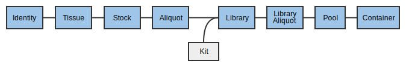

# 8. Runs and Orders
MISO supports runs from both Illumina and PacBio sequencers (and others that
are no longer used), so the terminology is intentionally different from
vendor-specific terminology. A _sequencing container_ is a cartridge loaded into
a sequencer (_e.g._, flow cell, SMRT cell pack). Each _lane_ (_e.g._,
Illumina lane, PacBio SMRT cell) is loaded with exactly one _pool_. MISO assumes that a
_sequencing container_ can be reused even if this isn't possible. Every time a
sequencer is loaded and sequencing begins, a _run_ is created. Runs can be
created manually, but usually they are picked up automatically from the
instrument.

The sequencing container must be connected to the run since it is the only link
between the samples/libraries and the runs. This information can be associated
as soon as the sequencer has started.

_Orders_ are meant to provide book-keeping and project management for what
pools need to be sequenced. An order, associated with a pool, describes how
much sequencing is to be done. With the run information, MISO can track whether
all the sequencing required for a particular pool has been completed.

## 8.1 Creating an Order
Orders include the pool to be sequenced, the quantity of sequencing
required (counted in lanes/SMRT cells), and the sequencing chemistry
required (on Illumina).

1. From the _List Pools_ page, find the pool created for this project.
1. Under the _Orders_ heading, fill in the new order box for `2` lanes, on `Illumina - Illumina HiSeq 2500`, with the `v4 2×126` chemistry.
1. Click _Add_.
1. The order will now be visible in the _Orders_ section.
1. From the navigation menu, choose _List Orders_.
1. Verify that the pool is listed in the _Unfulfilled_ tab.

The _List Orders_ page will be used by the sequencing team to decide what to
sequence. Columns on this page will disappear if there are no entries (_e.g._,
the _Failed_ column will not be shown if there are no failed runs). When enough
lanes have been sequenced, the row will disappear from the _Unfulfilled_ tab,
but remain in the _All_ tab. A run is created shortly after the sequencer
starts (typically 5 minutes) and the lanes currently being sequenced will be
marked as in-progress and remain on the _Unfulfilled_ tab until the run
transitions to _Completed_.

A pool can have many orders. Orders for the same platform and chemistry are
summed when displayed on this page.

## 8.2 Working with a Run
After the run has been detected by MISO, it needs to be associated with the pools.

1. From the _List Runs_ page, find the run assigned to you for this tutorial.
1. Under the _Containers_ section, find the pool previously created and double click to assign it to the lane.
1. Choose a study associated with the project and click _Select Study_.
1. If the lane container is being stored, also enter the location.
1. Click _Save_.
1. Click on the _List Orders_ page and verify that the _Remaining_ column now show 1 for the pool.

The validation field is used only by cBot; leave it blank.

[Back](7-pools) [Home](index) [Next](9-sequencers)
