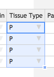

Table of Contents
<ol>
    <li><a href="#logging_in">Logging In</a></li>
    <li><a href="#receipt">Receiving Samples</a></li>
    <li><a href="#qcs">Adding Sample QCs</a></li>
    <li><a href="#boxes">Scanning samples into the outbox</a></li>
    <li><a href="#trouble">Troubleshooting</a></li>
</ol>



<a name="receipt" href="#" id="toplink">top</a>

# 2. Receiving samples

A _Sample_ contains information about the material upon which the sequencing
experiments are to be based. Samples can be used in any number of sequencing
_Experiments_ in the form of a _Library_ that is processed further into
single or pooled _Dilutions._

## 2.1 Receiving a Sample

Samples are most easily entered into MISO using the bulk entry screen.


    1. _QC Passed?_: `True`
1. At the upper right hand side, click _Save_.

Like in Excel, you can fill down a column by double-clicking the square at the lower 
right hand side of a selected cell. You can also click and drag to only fill in a 
certain number of cells.

<table border="1"><tr><td>

</td><td>

</td></tr></table>

Copy and pasting from Excel and Word is supported. Press Ctrl+V (Windows & Linux) or 
Command+V (Mac) on your keyboard to paste.

## 2.2 Scanning Samples into a Box

In this section we will add the Samples you just received into your
inbox for further work.



## 2.3 Bulk Editing

Samples can be edited in bulk. Assume that we wish to update the description of the samples.

1. Select the sample you wish to edit: 
  * If you are continuing from the end of section **2.1 Receiving a Sample**, do not
  navigate away from the page. At the top left of the table after saving samples, click
  the _Edit_ button. Continue to step 2. Otherwise, select samples using the following:
    1. On the _Samples_ page, enter your project name in the search box.
    1. Check the boxes for the samples that you created in section 2.1.
1. Click the _Edit_ button at the top left of the table.
1. Change the _Description_ value: any value
1. Click _Save_.

<a name="qcs" href="#" id="toplink">top</a>

# 3. Sample QCs

Several QC methods are supported in MISO.

## 3.1 Adding Bulk Sample QCs



<a name="boxes" href="#" id="toplink">top</a>

# 4. Scanning samples into outboxes

Finally, scan the samples you made into the outbox so the libraries team can take over.



<a name="trouble" href="#" id="toplink">top</a>

# Troubleshooting



< <a href="plain-1-0-project-coordination">Project coordination tutorial</a> | <a href="plain-index">Home</a> | <a href="plain-3-0-libraries">Libraries tutorial</a> >

