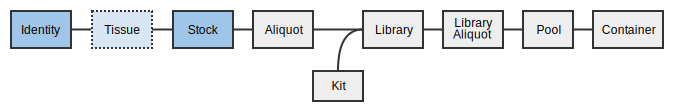
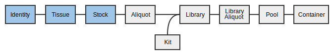

<video controls>
    <source src="presentations/miso_samples.mp4" type="video/mp4">
</video>

[Download the PDF]({{ '/presentations/miso_samples.pdf' | prepend: site.baseurl }})

Table of Contents
<ol>
    <li><a href="#logging_in">Logging In</a></li>
    <li><a href="#receipt">Receiving Samples</a></li>
    <li><a href="#props">Propagating Samples</a></li>
    <li><a href="#qcs">Adding Sample QCs</a></li>
    <li><a href="#boxes">Scanning samples into the outbox</a></li>
    <li><a href="#trouble">Troubleshooting</a></li>
</ol>

Print the worksheet for this section here: <a href="worksheet-detailed-samples">Samples Worksheet</a>.



<a name="receipt" href="#" id="toplink">top</a>

# 2. Receiving samples

A _sample_ contains information about the material upon which the sequencing
experiments are to be based. Samples can be used in any number of sequencing
_experiments_ in the form of a _library_ that is processed further into
single or pooled _library aliquots._

Every received sample must have an identity. The identity corresponds to the
individual or organism from whom the sample originated, i.e. the donor. MISO
requires you to assign an external name, which is usually an identifier from
another institution like a Donor ID.

When sample material is received, it may come in many different forms, called
_sample classes_ in MISO. Sample classes are divided into _sample categories_,
including

* Tissue
* Tissue Processing
* Stock
* Aliquot

Depending on which sample category is chosen, different fields appear on the
_Create Sample_ page, as these categories have different information associated
with them.

In this workshop, we will create six samples with four different identities in
the project you created in the last session.

## 2.1 Entering a Tissue

All samples in MISO are entered using the bulk entry screen. We will start by entering a single tissue sample from the
donor `PROJ_ID1`.


    1. _External Name_: this is the name of the *individual donor*, whether internal or
       external. For example, an external name would be "Morgan" (internally we refer to
       her as plain ol' MORG_0001).
        * Enter `PROJ_ID1` in the _External Name_ field, replacing `PROJ` with your project's
          short name. Record this in your worksheet.  
            * Once you enter an external name, MISO will go and find any existing donors with
              external name(s) that match this, and will add them to the dropdown menu for the
              _Identity Alias_ field.
            * If there are no existing donors with the exact external name, the option of
              `First Receipt (project short name)` will be available.
            * If more than one option is available in the _Identity Alias_ dropdown, the cell
              will be displayed with a light purple background.
    1. Select `First Receipt (project short name)` for the _Identity Alias_.
    1. _Donor Sex_: Select any item from the dropdown.
    1. _Tissue Origin_: `{{ site.tissue_origin_1 }}`
    1. _Tissue Type_: `{{ site.tissue_type_1 }}`
    1. _Times Received_: `1`
    1. _Tube Number_: `1`
    1. _Secondary ID_: `BioBankID 1`. This is the Biobank ID or Tube ID. It may also be left
       blank.
    1. _Material_: Select any from the drop-down.
    1. _QC Status_: select `Ready` from the drop down.
1. At the upper right hand side, click _Save_.

Upon saving, a number of fields will be filled in, including the sample ID, name, and alias. The name will be in the
form "SAM123", where "123" is the ID. This is a unique identifier for the sample within MISO. The alias will be
generated based on the naming scheme configured for your site. This is a more human-friendly identifier for the sample.
Record the alias in your worksheet. 

## 2.2 Automatically created Samples

1. Click the _Projects_ link under _Preparation_ in the menu on the left side of the screen and
select your project from the list.
1. Open the _Samples_ section on the _Edit Project_ page to see your newly
created samples.

You can also find your samples by searching on the _Samples_ page or by using the widget
on the MISO front page; however, the widget does not show enough information for the
following exercises.

You only created a single sample but at least two are in this list: the {{ site.tissue_class }} as well as the
{{ site.identity_class }}. The {{ site.identity_class }} sample was automatically created because you provided an
_External name_ that had not been previously used in this project. Other types of samples are created automatically
depending on how you propagate them through to libraries. Some of them will be addressed in the following tutorials.

## 2.3 Entering bulk Tissues

Next, we will create four more {{ site.tissue_class }} samples for individuals 1-4.



If you navigate back to your _Edit Project_ page, there should be nine samples:

* 4 {{ site.identity_class }} samples
* 5 {{ site.tissue_class }} samples

## 2.4 Receipt Transfers



## 2.5 Receiving Stock DNA/RNA

The process for receiving stock is very similar to receiving tissue. Every stock derives from a tissue, which originated
from an {{ site.identity_class }}. MISO will automatically create a tissue for you when you enter a stock. This tissue
does not represent a sample that is present at your site, but is created so that tissue-level information about the
sample can still be recorded. This tissue sample is referred to as a _ghost sample_.

In this section, we will 'receive' a single stock DNA tube from the tissue material of an existing identity.

1. On the left hand menu under _Preparation_, click _Samples_.
1. Click the _Create_ button at the top left of the table.
1. Select Sample Category `Stock` and Quantity `1`.
1. Click _Create_.
1. In the table, enter or select the following:
  * _Sample Name_: Leave blank. This will be auto-generated after save.  
  * _Sample Alias_: Leave blank. This will be auto-generated after save.
  * _Description_: `Stock 1`.
  * _Date of receipt_: Select a date.
  * _Received From_: Select any lab.
  * _Received By_: Select any group.
  * _Project_: Select your project's short name from the drop-down.
  * _Subproject_: Select the subproject you created.
  * _Sample Class_: Select `{{ site.stock_class }}` from the drop-down.
  * _Sample Type_: Select `GENOMIC` from the drop-down.
  * _Scientific Name_: `{{ site.scientific_name }}`.
  * _External Name_: `PROJ_ID2` (where `PROJ` is your project's short name).
  * _Identity Alias_: The existing identity should be selected automatically
    in the dropdown menu.
  * _Tissue Origin_: `{{ site.tissue_origin_3 }}`
  * _Tissue Type_: `{{ site.tissue_type_1 }}`
  * _Times Received_: `1`
  * _Tube Number_: `1`
  * _Secondary ID_: `BioBankID 6`.
  * _STR Status_: select any value from the dropdown menu.
  * _Volume_: `300`
  * _Vol. Units_: `µL`
  * _QC Status_: select `{{ site.detailed_qc_status_good }}` from the dropdown.
1. At the upper right hand side, click _Save_.

When you click 'Save', the name and alias will be filled in. Record the external name,
sample class, and alias in your worksheet. 

After saving, go back to your project page and look at the samples that were automatically created. Although you
received a {{ site.stock_class }}, it has created a {{ site.tissue_class }} for you as well.

1. Click on the tissue with tissue origin `{{ site.tissue_origin_3 }}` and tissue type `{{ site.tissue_type_1 }}`.

At the top, you will see a grey section with the warning: "This entity does not exist except for sample tracking
purposes!". This indicates that it is a _ghost sample_ used only for informational purposes, and is not a physical
sample that could be found on premises.

# 2.6 Scanning tissues and stocks into a Box

In this section we will add the stocks and tissues you just received into your
inbox for further work.



<a name="props" href="#" id="toplink">top</a>

# 3. Propagating Samples

Samples in MISO exist for each step of the sample preparation process: from identity,
to tissue, optionally through tissue preparation, to stock, to aliquot. At each
step, the possible options are limited based on the established workflows.
Group IDs may be assigned at any time and are copied when propagating. Different
QC information is available at each step. For instance, STR status is attached
to the stock.

## 3.1 Propagating to Tissue Processing

Tissue processing is an optional step between the tissue and stock levels of the
sample hierarchy. It includes steps such as slides and laser capture microdissections
created from the tissue.

Create a {{ site.slide_class }} from one of your Tissue samples.

1. On the _Samples_ page, enter your project name in the search box.
1. Check the box for the {{ site.tissue_class }} you created in exercise 2.1. It will have tissue origin
   {{ site.tissue_origin_1 }} and tissue type {{ site.tissue_type_1 }}.
1. Click the _Propagate_ button at the top left of the table.
1. Enter `1` replicates to `Tissue Processing`.
1. Click _Propagate_.
1. Fill out the table:
  * _Description_: CV Slides
  * _Sample Class_: `{{ site.slide_class }}`
  * _Sample Type_: `OTHER`
  * _Slides_: 3
  * _Stain_: Choose any option from the dropdown.
  * _QC Status_: `{{ site.detailed_qc_status_good }}`
1. Click _Save_.

Upon successful save, a green status bar will show at the top that says "Saved 1
items". The sample name and alias will have been filled in automatically.
Record the alias in your worksheet. 

## 3.2 Bulk Propagate Samples

For three of the {{ site.tissue_class }} samples created previously (by bulk entry), we will
create stocks for library preparation.

1. On the _Samples_ page, enter your project name in the search box.
1. Check the boxes for any three of the the {{ site.tissue_class }} samples with tissue type {{ site.tissue_type_2 }}
   that you created in section 2.3.
1. Click the _Propagate_ button at the top left of the table.
1. Enter `1` replicates to `Stock`.
1. Click _Propagate_.
1. Fill out the table:
  * _Description_: Free text description. In this case, use "Stock (Tissue Type)(Individual)". (e.g. `Stock P2`)
  * _Matrix Barcode_: Choose a barcode for each stock. If you were not given barcodes to use,
    enter the following instead, replacing `PROJ` with your project's short name. Record the
    barcodes on your worksheet. 
        * `PROJ-301`
        * `PROJ-302`
        * `PROJ-303`
  * _Sample Class_: `{{ site.stock_class }}`
  * _Sample Type_: Select any value if one is not selected automatically.
  * _STR Status_: Select any value from the drop-down.
  * _Volume_: `300`
  * _Vol. Units_: `µL`
  * _QC Status_: `Not Ready`
1. Click _Save_.

Upon successful save, a green status bar will show at the top that says "Saved 3
items". The sample names and aliases will have been filled in automatically.
Record the aliases in your worksheet. 

## 3.3 Bulk Editing

Samples can be edited in bulk. Assume that we have done some quality control
and wish to update the QC status of the samples.

In this case we will update several fields of 4 stock samples. We will use the
stocks we entered in the previous step as well as the reference stock entered in
part 2.4 of this tutorial.

1. On the _Samples_ page, enter your project name in the search box.
1. Check the boxes for the {{ site.stock_class }} samples (propagated and received) that you created in
   sections 2.4 and 3.2.
1. Click the _Edit_ button at the top left of the table.
1. Add a _Concentration_ value: any number
1. Change the _QC Status_ column to `Ready` for all rows.
1. Enter a _Matrix Barcode_ for the stock entered in section 2.4. If you weren't given a
   barcode to use, enter `PROJ-401`, replacing `PROJ` with your project's short name. Record
   the barcode on your worksheet. 
1. Click _Save_.

Upon successful save, a green status bar will show at the top that says "Saved 4
items.".

## 3.4 Creating Aliquots

Propagate again from the 4 _{{ site.stock_class }}_ samples to _{{ site.aliquot_class }}_.

1. If you are continuing from the end of section **3.3 Bulk Editing**, do not
  navigate away from the page.
    1. At the top left of the table after saving samples, click the _Propagate_ button.
    1. Enter `1` for the number of replicates (child samples to be created from each parent)
       and `Aliquot` for the category of child sample. Continue to step 3.
1. Otherwise, select samples using the following:
    1. On the _Samples_ page, enter your project name in the search box.
    1. Check the boxes for the {{ site.stock_class }} samples.
    1. Click the _Propagate_ button at the top of the table.
    1. A dialog will appear. Select `1` replicate to `Aliquot` and click _Propagate_.
1. Fill out the table:
    * _Sample Alias_: Skip this field. It will be automatically filled in upon save.
    * _Description_: Free text description. In this case, use "Aliquot (Tissue Type)(Individual)". (e.g. `Aliquot P2`)
    * _Matrix Barcode_: choose a barcode for each aliquot. If you weren't given barcodes to use, enter the following
      instead, replacing `PROJ` with your project's short name. Record the barcodes on your worksheet.
      
        * `PROJ-501`
        * `PROJ-502`
        * `PROJ-503`
        * `PROJ-504`
    * _Sample Class_: Select `{{ site.aliquot_class }}`.
    * _Sample Type_: Select any value if one is not selected automatically.
    * _QC Status_: Select `{{ site.detailed_qc_status_good }}`.
    * _Purpose_: Select any option from the dropdown.
1. Click _Save_.

Upon successful save, a green status bar will show at the top that says "Saved 4
items". Buttons to allow editing the samples or propagating them will show at
the top of the table. The sample names and aliases will have been filled in
automatically. Record these on your worksheet. 

<a name="qcs" href="#" id="toplink">top</a>

# 4. Sample QCs

## 4.1 Adding Sample QCs



<a name="boxes" href="#" id="toplink">top</a>

# 5. Scanning aliquots into outboxes



<a name="advanced-search" href="#" id="toplink">top</a>

# 5. Advanced Search

Some of the list pages feature advanced search functionality which allows you to narrow down the
items displayed by specifying which attributes you would like to search by. Any list featuring
advanced search will display a question mark in a black circle beside the _Search_ bar.

1. Go to the _Samples_ list page.
1. Hover your mouse over the question mark icon beside the _Search_ box. The list of search terms
   that you can use is displayed.
1. Click the question mark icon. A dialog appears describing the search syntax in more detail.
1. Click the _X_ in the top right corner of the dialog to dismiss it.
1. In the _Search_ box, type `PROJ entered:today is:real`, replacing `PROJ` with the short name of
   your own project, and hit _Enter_ on your keyboard. All of the samples you created in your
   project today will appear. The ghost samples that were automatically created will be excluded
   from the list.

<a name="trouble" href="#" id="toplink">top</a>

# Troubleshooting



**How do you work with multiple samples derived from the same identity (i.e. DNA and RNA from one tissue slide, DNA from metastasis and control)**

On the _Samples_ page, you can enter the identity's alias into the search box to filter the list.
If the samples you are looking for have more of their alias in common, you can enter as much as
they share to further narrow the search. e.g. to find all stock samples made from tissue
`PROJ_0001_04`, you could search for `PROJ_0001_04`.

Once you have found all of the samples you wish to work with, select them by clicking the
checkboxes on the left, and choose a bulk action from the menu at the bottom.

**How do I correct a sample that has the wrong information, e.g. wrong tissue type?**

Most sample attributes may be modified either individually, or in bulk. To access the
_Edit Sample_ page for a single sample, click the sample's name or alias on the _Samples_ page.
To bulk edit a set of samples, click the checkboxes next to them on the _Samples_ page and click
_Edit_ at the top left of the table.

For attributes which cannot be changed via MISO (e.g. Sample Class), {{ site.miso_admin_contact }} for help. This may
require deleting and re-creating the sample.

**What if I need to change the parent of a sample? (e.g. for swaps)**

A sample's parent cannot be changed. You will have to delete and re-create the sample by propagating from the correct
parent sample.

**How can I add a new lab, tissue material, tissue type, tissue origin, or add anything else in drop-down menus?**

Some of these items can be added directly:

1. From the _Misc_ or _Configuration_ section of the menu, click the category of
   interest.
1. Click _Add_ from the toolbar.
1. Enter the appropriate information.
1. Click _Create_.

For items that you are not able to add yourself, please {{ site.miso_admin_contact }} for assistance.

< <a href="tutorial-detailed-project-coordination">Project Coordination</a> | <a href="index">Home</a> | <a href="tutorial-detailed-libraries">Libraries</a> >
