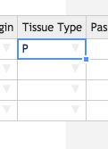

#Incoming samples

A _Sample_ contains information about the material upon which the sequencing
experiments are to be based. Samples can be used in any number of sequencing
_Experiments_ in the form of a _Library_ that is often processed further into
pooled _Dilutions._

Every received Sample must have an _Identity_. The Identity corresponds to the
individual or organism with whom the sample originated, i.e. the donor. MISO
requires you to assign an external name, which is usually an identifier from
another system such as a BioBankID or sample name from another institution.

When material is received for sequencing, it can be in many different forms,
called _Sample Classes_ in MISO. Here are the classes of Sample that can be
received in MISO:

* Cell line
* Tumour tissue (Primary or Metastatic)
* Reference tissue
* Xenograft tissue
* gDNA (untreated or whole genome amplified)
* cDNA
* whole RNA

Depending on which Sample Class is chosen, more or less fields appear on the
_Create Sample_ page.

In this workshop, we will create five Samples with five different Identities in
the Project you created in the last session. 

## Entering a single Sample

There are two ways of entering Samples into MISO: Single and Bulk. We will start
by entering a single Sample for reference tissue from the Identity "ID1".

1. On the left hand menu under _Tracking_, click _List Samples_.
1. Click the _Add Sample_ button on the right hand side. There are two tabs
across the top. Ensure that _Single_ is selected.
1. For _Project_, Select the project you created in the last exercise.
1. Leave the _Alias_ blank. This will be auto-generated based on other
information in this form.
1. Enter a _Description_: `Reference 1`.
1. Enter a _Scientific Name_: `Homo sapiens`.
1. Select any _Sample Type_ from the drop-down.
1. In the _Identity_ section, enter the 
  1. _External name_ : `ID1`. This is the individual number.
  1. Sex: Select any item from the dropdown.
1. In the _Details_ section, select the _Sample Class_ `Reference Tissue`.
1. In the _Tissue_ section, select or enter the following to create a reference Sample.
  1. Tissue Origin: `Lymphocyte`
  1. Tissue Type: `Reference or non-tumour, non-diseased tissue sample`
  1. Tissue Material: Select any from the drop-down.
  1. External Institute Identifier: `BioBankID 1`. This is the Biobank ID or Tube ID.
It may also be left blank.
  1. Times Received: `1`
  1. Tube Number: `1`
1. At the upper right hand side, click _Save_.

Upon saving, a number of fields will be filled in, including the Alias. The
Alias will be in the form DI4S_0001_Le_R_nn_1-1: (Project Short
Name)_(Individual ID)_(Tissue Origin)_(Tissue Type)_(Passage number)_(Times
Received)_(Tube Number). Passage number is only required for Xenografts and Cell
lines. For more information about Sample nomenclature, see [Sample
nomenclature](https://wiki.oicr.on.ca/display/MCPHERSON/LIMS+Guidelines#LIMSGuidelines-SampleNomenclature).

### Enter a matrix tube barcode

After saving the Sample, you will be able to enter the barcode for the tube.

1. On the _Edit Sample_ page for the appropriate sample, click the arrow next to
the blue _ID_ box at the top right hand corner.
1. Select _Assign New Barcode_ from the menu.
1. Use the hand-scanner or type a barcode into the pop-up. For this exercise,
enter your Project Short Name and _R1. e.g. `DI4S_R1`. We will use this barcode
later in the Box section.
1. Click _Save_ on the pop-up.

The page will re-load with the 2D barcode at the top right.

## Automatically created Samples

1. Click the _My Projects_ tab at the top and select your project from the list.
1. Open the _Samples_ section on the _Edit Project_ page to see your newly
created samples.

(At the moment, searching on the _List Samples_ page is quite slow but you are
welcome to try using that page to view your samples.)

You only created a single Sample but at least two are in this list: the
Reference tissue as well as the Identity. The Identity sample was automatically
created because you provided an _External name_ that had not been previously
used in this Project. Other types of Samples are created automatically depending
on how you propagate them through to libraries. Some of them will be addressed
in the following tutorials.

## Bulk create Samples

Next, we will create four more Samples using the much faster bulk method.

1. On the left hand menu under _Tracking_, click _List Samples_.
1. Click the _Add Sample_ button on the right hand side. There are two tabs
across the top. Ensure that _Bulk_ is selected.
1. Select your project from the drop-down.
1. For _Select class_, choose `Primary Tumor Tissue`.
1. Click _Make Table_.
1. In the pop-up that asks for number of samples, enter `4` and click _OK_.

A table will appear with the requested number of samples in table format. We
will fill in the first row and use the quick-fill option to fill in the rest of
the table.

Enter the following values into the **first row only**.

1. Leave _Sample Alias_ blank. Again, this will be automatically generated from
the rest of the table.
1. Select or enter the following fields: 
  1. _Description_: `Primary`.
  1. _Sample Type_: select any item from the drop-down.
  1. _Sex_: select any item from the drop-down.
  1. _Tissue Origin_: `Br`
  1. _Tissue Type_: `P`
  1. _Times Received_: 1
  1. _Tube Number_: 1
  1. _Material_: Select any item from the drop down.
  1. _Ext. Inst. Identifier_: `BioBankID`

Now we will fill in the rest of the table. Like in Excel, you can fill down a
column by double-clicking the square at the lower right hand side of a selected
cell. You can also click and hold to only fill in a certain number of cells.

1. Click the _Description_ cell in the first row. A blue square will appear at
the lower right hand side. Double click it to fill in the rest of the table with
the word "Primary". 
1. Fill in the columns in the same way for: _Sample Type_, _Sex_, _Tissue
Origin_, _Tissue Type_, _Times Received_, _Tube Number_, and _Material_.

<table border="1"><tr><td>

</td><td>

</td></tr></table>

Some fields cannot be filled down, so enter each of those separately.

1. In the _Description_ field, add a number to each row starting with 1, i.e..
`Primary 1`, `Primary 2`, `Primary 3`, `Primary 4`.
1. For each row of _Matrix Barcode_, you would normally use a hand-scanner or
copy and paste the list from a spreadsheet. In this case, enter the project
short name followed by P#. For example:`DI4S_P1`, `DI4S_P2`, `DI4S_P3`, `DI4S_P4`
1. For _External Name_, copy the list below by selecting it with your mouse, right
clicking and selecting _Copy_. Then click on the first cell in the top row of
_External Name_ and press Ctrl+v on your keyboard to paste.
 `ID1` `ID2` `ID3` `ID4`
1. In _Ext. Inst. Identifier_, add a number to each row starting from 2, i.e..
`BioBankID 2`, `BioBankID 3`, `BioBankID 4`, `BioBankID 5`.
1. Click _Save_ at the upper right hand corner.

If everything is correct, the _Alias_ will be auto-generated for each row and
the samples will be saved. If you navigate back to your _Edit Project_ page,
there should be nine Samples:

* 4 Identity Samples
* 1 Reference Sample
* 4 Primary Samples

Notice also that because you used the same _External Name_ `ID1` for two
samples, reference and primary, they have the same Identity.

## Receiving Stock

The process for receiving Stock DNA is very similar to receiving tissue, but it
creates _ghost samples_, which do not exist but are in MISO for sample tracking
purposes.

1. On the left hand menu under _Tracking_, click _List Samples_.
1. Click the _Add Sample_ button on the right hand side. There are two tabs
across the top. Ensure that _Single_ is selected.
1. For _Project_, Select the project you created in the last exercise.
1. Leave the _Alias_ blank. This will be auto-generated based on other
information in this form.
1. Enter a _Description_: `Stock 2`.
1. Enter a _Scientific Name_: `Homo sapiens`.
1. Select any _Sample Type_ from the drop-down.
1. In the _Identity_ section, enter the
  1. _External name_ : `ID2`.
  1. Sex: Select any item from the dropdown.
1. In the _Details_ section, select the _Sample Class_ `gDNA (stock)`.
1. In the _Tissue_ section, select or enter the following to create a reference
Sample.
  1. Tissue Class: `Reference Tissue`
  1. Tissue Origin: `Unknown`
  1. Tissue Type: `Reference or non-tumour, non-diseased tissue sample`
  1. Tissue Material: Select any from the drop-down.
  1. External Institute Identifier: `BioBankID 6`.
  1. Times Received: `1`
  1. Tube Number: `1`
1. At the upper right hand side, click _Save_.

After saving, go back to your project page and look at the samples that were
automatically created. Although you received Stock DNA, it has created a Tissue
for you as well.

1. Click on the Sample with the alias similar to `DI4S_0002_nn_R_nn_1-1`. It
should have a _Sample Description_ that says only "Tissue".

At the top, you will see a grey section with the warning: "This entity does not
exist except for sample tracking purposes!". This message means that the Tissue
does not exist in a freezer at OICR. Eventually these _ghost samples_ will be
hidden from the MISO interface.

[Back](readme.md)

